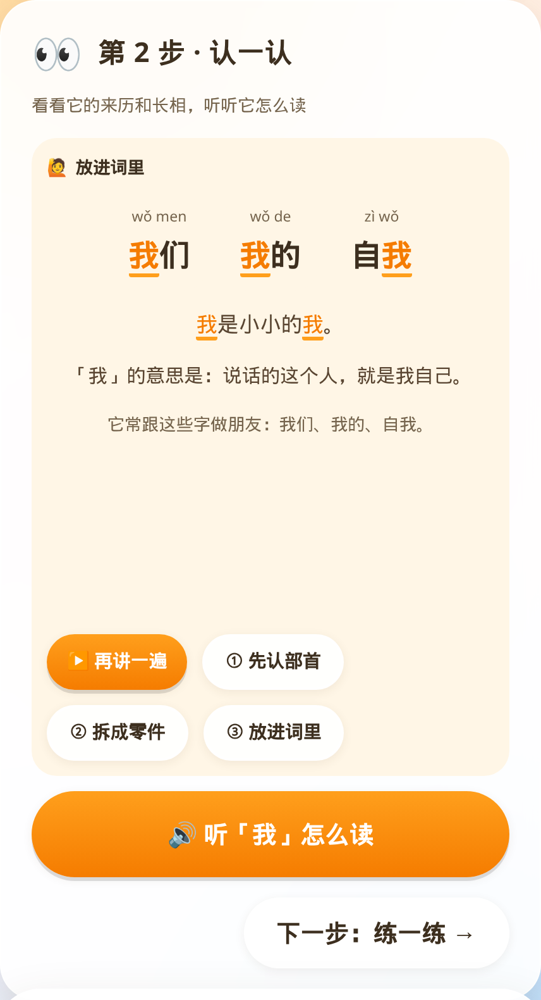
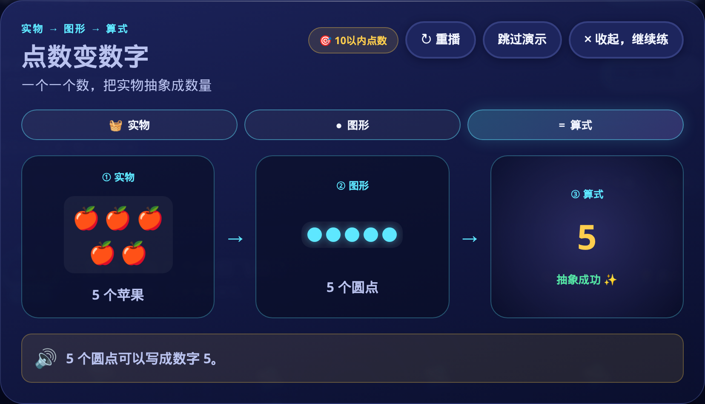
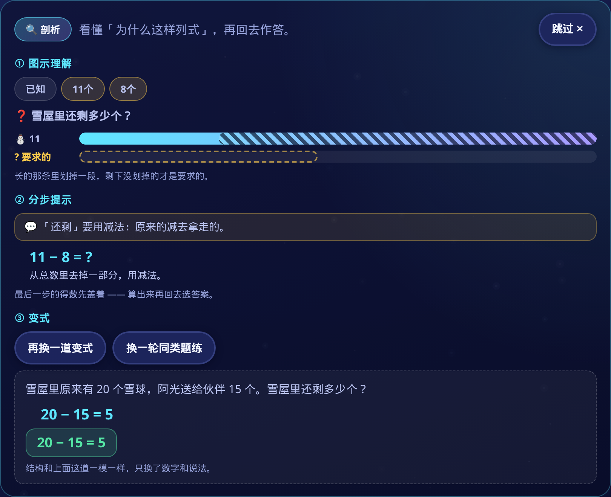
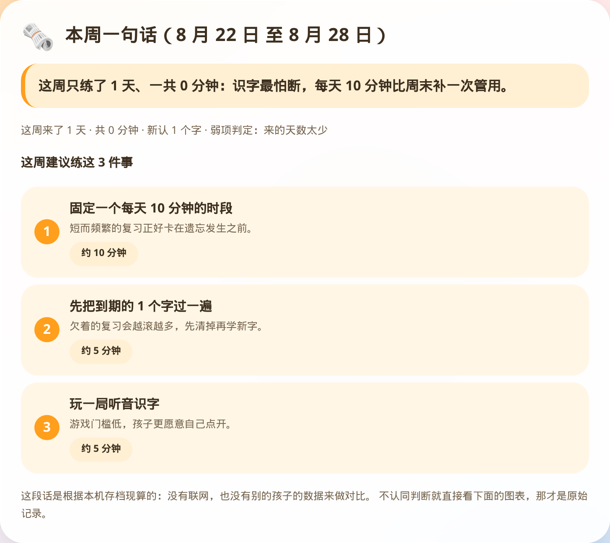
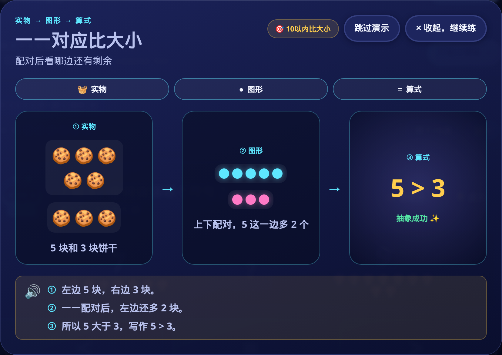

# Round 17 · H6 走查证据包

> 分支 `cursor/r17-walkthrough-bundle-9f67`，走查的树 = 本分支 `8bbcc65`（从
> `origin/cursor/r17-orchestration-9f67` 的 `9a8b0f5` 开出来）。
> 截图机 `scripts/walkthrough-shots.mjs`，一条命令重跑：`npm run walkthrough:shots`。
> 原始清单（每张图的落盘字节数与生成时刻）：`evidence/r17/walkthrough/shots.json`。

## 这份东西是怎么产生的

`npm run build` 出两个 App 的 dist，脚本给它们各挂一台本地静态服务，再用真
Chrome（148.0.7778.96 / Node v22.14.0，headless）**从入口一路点进去**，到值得
看的画面就落一张 PNG。不是对着组件单独渲染，也不是把设计稿导出来——每张图
都是这一次走查里浏览器实际画出来的那一帧。

图上写的 `data-*` 值都是**快门前一刻现读 DOM** 得到的。这条一开始是错的：自动
播的演示每两秒换一段，滚动定位那 400 ms 里画面已经往前走了，于是说明写着
「演到实物」而图上亮着「图形」。修在 `8bbcc65`，说明文字改成快门前才算。

家长周报那两张**故意排在最后**：前面几幕答的题会真的落进本机存档，周报读的就是
那一份。所以周报上的「做了 9 道题」「新认 1 个字」是这次走查自己攒出来的，
不是手搓的假数据；也因此数学侧全程共用一个浏览器上下文，中途不清 localStorage。

## 四条路径

### ① 无字源认步（识字）

走法：脚本先查一遍 `char-index` 与 `etymology-index`，取第一个**确实没有字源
语料**的常用字（这一轮取到「我」），直接进 `/#/learn/我`，清掉存档重载，再从
步骤条点到第 2 步「认一认」——点得动本身就说明这一步没被锁住。

有字源的字这里挂的是演变动画（`data-intro-stage="etymology"`）；没有字源的字
落到 `IntroFallbackStage`，标记是 `intro-fallback.js` 里的
`ROUND16_H2 = 'intro-fallback-stage'`。脚本读到 `etymology` 会直接报错退出，
所以这两张图不可能是拿有字源的字冒充的。


`data-scene=radical`：部首牌「戈」立起来，下面「一家子还有：戏 或 成 戒 战」是
同部首兄弟字，底下三个幕次按钮（① 先认部首 ② 拆成零件 ③ 放进词里）说明这一步
是三幕而不是一行释义。



`data-scene=word`：我们 / 我的 / 自我，目标字在词里点亮，带拼音。三幕会自己往
下走，末幕还会挂一个「马上进入下一步」的倒计时——为了停住看清楚，脚本一边等
一边把倒计时按住，这也顺带验证了那个按钮是真能按停的。

相关代码：`apps/literacy-app/src/components/IntroFallbackStage.vue`、
`apps/literacy-app/src/data/intro-fallback.js`。

### ② 学演示（数学）

走法：进 `/#/number-sense`（数量星云）正常做题，点题面上的「🎞️ 看演示」。
这是孩子卡住时真会走的入口，不是直接敲演示中心的路由。


这一轮点开的是「点数变数字」（技能 `count-to-10` / 演示 `counting`）。
`data-demo-motion=play`，正播到 `data-demo-stage=visual`：① 实物段已经点亮，
② 图形段是当前段，③ 算式段还压着暗。顶上「实物 → 图形 → 算式」三个页签、
「重播」「跳过演示」「× 收起，继续练」全程都在。



一路点「下一步」到 `data-demo-stage=equation`，三段并排全亮。证明三态不是只
画了第一张。

弹层收起后脚本接着答了几题（有对有错），说明演示**不接管这一轮**：题序、
连击、计时都还归玩法页管。开哪条演示取决于当时题面上的技能点，所以重跑一次
未必还是这一条——上一轮跑到的就是「数到最后那个数」（`count-to-5`）。

相关代码：`apps/math-app/src/components/LearnDemoLauncher.vue`、
`LearnDemo.vue`（`ROUND16_H4`）、`apps/math-app/src/data/learn-demos.js`。

### ③ 应用题剖析（数学）

走法：进 `/#/word-problems`，点题面上的「🔍 剖析」，试着点「全部摊开」（多步题
默认只摊到倒数第二步；这一轮抽到的是一步题，所以没有这个按钮），再点
「看一道同结构的变式」。



`data-analysis="diagram-steps-variant"`（`ROUND16_H5`），三段齐：

1. **图示理解**——已知 chip（11 个 / 8 个）、问句「雪屋里还剩多少个？」，
   条形图把「拿走的那一段」用斜纹划掉，剩下的虚线框就是要求的。
2. **分步提示**——「『还剩』要用减法：原来的减去拿走的」，列式 `11 − 8 = ?`，
   末步得数**按设计盖着**（面板自己写了「最后一步的得数先盖着 —— 算出来再回去
   选答案」），所以剖析不会直接把答案递出去。
3. **变式**——「雪屋里原来有 20 个雪球，阿光送给伙伴 15 个」，同结构换数换说法。

右上角「跳过 ✕」全程在。看完剖析脚本又答了几题，答题链路没有被面板卡住。

相关代码：`apps/math-app/src/components/WpAnalysisPanel.vue`、
`apps/math-app/src/utils/wpAnalysis.js`。

### ④ 家长周报（两个 App）

走法：进 `/#/parent`，读题面上的口算门算出答案填进去过门，再看「本周一句话」
那张卡。


`data-weakness="thin"`：「这周来了 1 天 · 共 1 分钟 · 做了 9 道题」——这 9 道就是
第 ②③ 幕答出来的。下面三条建议每条都是可点的路由（今日冒险 / 速算冲刺 / 回星图）。



`data-weakness="thin"`：「来了 1 天 · 共 0 分钟 · 新认 1 个字」——那 1 个字就是
第 ① 幕的「我」。第 2 条建议「先把到期的 1 个字过一遍」直接对上了它。

两张底下都印着同一句话：这段判断是按本机存档现算的，没有联网、也没有拿别的
孩子做对比。

相关代码：`apps/math-app/src/utils/weeklyReport.js` 与
`apps/literacy-app/src/utils/weeklyReport.js`（两边共用 `ROUND16_H7` 口径）、
各自的 `src/composables/useWeeklyReport.js` 与 `ParentView.vue`。

## ⑤ 附加：降动效下的学演示

验收 G4 要求「reduced-motion 可完成」。这一幕把 Chrome 的
`prefers-reduced-motion` 设成 `reduce` 再走一遍同一个入口。



这一轮题面上的技能点不同，开出来的是另一条演示「一一对应比大小」（`comparison`）。
`data-demo-motion=static`、一进来就停在 `data-demo-stage=equation`：三段同时
铺开、旁白三条一次列全、**没有**「下一步」等着点，「跳过演示」照常在。脚本
读到 `motion` 不是 `static` 会直接报错，所以这张不是「把动画截个尾帧冒充」。

## 走查里发现的问题

**1. 母题声明的步数和剖析真正拆出来的步数，有 56/214 对不上。**
`WordProblemsView.buildQuestion()` 拿 `template.steps` 决定星数、XP 和错因标签
（`one-step` / `two-step` / `multi-step`），而剖析面板的分步是
`wpAnalysis.buildAnalysis()` 现解析 `equation` 得到的。把 214 道母题各实例化一次
比对：

| 声明 → 实际拆出 | 母题数 |
| --- | --- |
| 1 → 1 | 93 |
| 2 → 2 | 64 |
| 2 → 3 | 11 |
| 2 → 1 | 11 |
| 3 → 2 | 34 |
| 3 → 3 | 1 |

最扎眼的是「声明 3 步、实际只拆出 2 步」那 34 道：孩子按 3 步题拿的星和 XP，
剖析里只看得到 2 步。这不影响答题，但错因统计里的 `multi-step` 和孩子实际
看到的推理链长度不是一回事，做归因时要当心。

**2. 有余数除法的剖析只有一步。** 上表「2 → 1」那 11 道全是余数题
（`div-remainder`、`left-over-*`），算式形如 `20 ÷ 3 = 6 …… ?`。解析器把它算成
一步，`why` 写的是「3 个一份地分，分得出 6 份，分不完的 2 就是余数」——话没
说错，但「先看装满几袋」这半步没有单独成步，而余数题恰恰是最需要把这两半拆开
讲的一类。

**3. 单场走查判不出「thin」以外的周报分支。** 弱项规则里 `thin` 的条件是
「活跃 ≤2 天且 <25 分钟」，优先级排在错题欠账、错因反复、正确率偏低之前。一场
走查只可能落在一天里，所以无论答多少题、错多少题，周报必然判 `thin`。上面那两
张图能证明的是「周报读的是真存档、数字对得上、建议可点」，**不能**证明其它分支
的文案。那几条分支由 `npm run test:mascot`（`scripts/test-mascot-weekly.mjs`）
用构造存档覆盖，不在本证据包里。

## 边界（这份包不能证明什么）

- 全程 headless Chrome + 本地 dist，**不是真机**。Android 侧归 H7 管，走查时
  `evidence/r17/` 下还没有它的报告，能查到的最近一份是
  `evidence/r13/android-sim/report.json`，与本包无关。
- 无音频：跑的时候带了 `--mute-audio`，跟读、旁白配音、音效都没有验证。
- 学演示当前覆盖 21 条 / 21 个技能点，课程表里共 34 个技能点；剖析当前是解析
  `equation` 生成的，没有手写精品讲解。这两项是 R17 H3/H4 要补的缺口，本包只
  记录走查当时的样子，不代表已达标。
- 每张图都是**这一次**运行的产物。演示挑哪条、应用题抽哪道都跟当时的存档和随机
  题序有关，重跑会换一道题——但走的路径和读的 `data-*` 契约是固定的。
- 脚本日志里那句「答了 8 题」是**点击次数**，不等于 App 记下来的题数：这一轮两幕
  一共点掉 16 次，周报卡上记的是 9 道。差额没往下查（有可能是点在了轮次结算的
  空档上，也有可能是别的），所以别拿脚本日志当作答统计用；要看数就看周报卡。

## 复现

```bash
npm run build                 # 出两个 App 的 dist
npm run walkthrough:shots     # 落 8 张 PNG + shots.json 到 evidence/r17/walkthrough/
npm run walkthrough:shots -- intro-fallback wp-analysis   # 只跑其中几幕
```

需要本机有 Chrome/Chromium（脚本按 `CHROME_PATH` → `/usr/local/bin/google-chrome`
→ `/usr/bin/chromium` 的顺序找）。任何一幕的契约断言没过，脚本非零退出，不会留下
一份「看着挺全」的假证据。

## 探针

本分支上 `npm run check:round17` 的原话：

```
Round 17 check (ROUND17-v1.0): 3/8

✓ H1 Round17 差距续表就位
✓ H6 走查证据包就位（引用 8，落盘 8）
✓ H7 真机/模拟闭环或诚实 BLOCKED 台账就位
✗ H2 富 Play 不足：rich=640(需≥900)，narration去重=640(需≥720)，标记=false
✗ H3 学演示不足（标记=true，三态=true，可跳过=true，计数=21）
✗ H4 精品剖析不足（标记=false，计数=0）
✗ H5 缺学伴关键接线（ROUND17_H5）
✗ H8 check:round16 7/8（需要 8/8）
```

H6 是本包要交的那条，绿了。H2/H3/H4/H5 是别人的活，红是预期内的。

H8 这条红要打个折扣：往下追是 `check:round16` 的 H8 → `check:round15` 的 H8 →
`check:round13` 的 H6，那一条要比对
`apps/*/android/app/build/outputs/apk/debug/app-debug.apk` 的 SHA256。APK 是
gitignore 掉的构建产物，新开的 worktree 里本来就没有，`npm run android:sim`
重建一次就回来。跟本包的改动无关。

## 文件清单

| 文件 | 覆盖 |
| --- | --- |
| `evidence/r17/walkthrough/r17-literacy-intro-fallback-radical.png` | ① 无字源认步·第一幕 |
| `evidence/r17/walkthrough/r17-literacy-intro-fallback-word.png` | ① 无字源认步·第三幕 |
| `evidence/r17/walkthrough/r17-math-learn-demo-overlay.png` | ② 学演示·玩法页弹层 |
| `evidence/r17/walkthrough/r17-math-learn-demo-equation.png` | ② 学演示·三态末态 |
| `evidence/r17/walkthrough/r17-math-learn-demo-reduced-motion.png` | ⑤ 降动效（验收 G4） |
| `evidence/r17/walkthrough/r17-math-wp-analysis.png` | ③ 应用题剖析 |
| `evidence/r17/walkthrough/r17-math-parent-weekly.png` | ④ 家长周报·数学 |
| `evidence/r17/walkthrough/r17-literacy-parent-weekly.png` | ④ 家长周报·识字 |
| `evidence/r17/walkthrough/shots.json` | 每张图的说明与落盘字节数 |
| `scripts/walkthrough-shots.mjs` | 截图机本身 |
