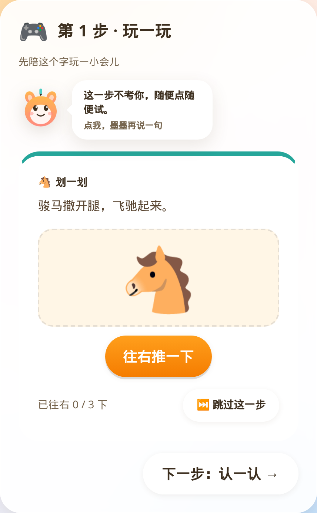
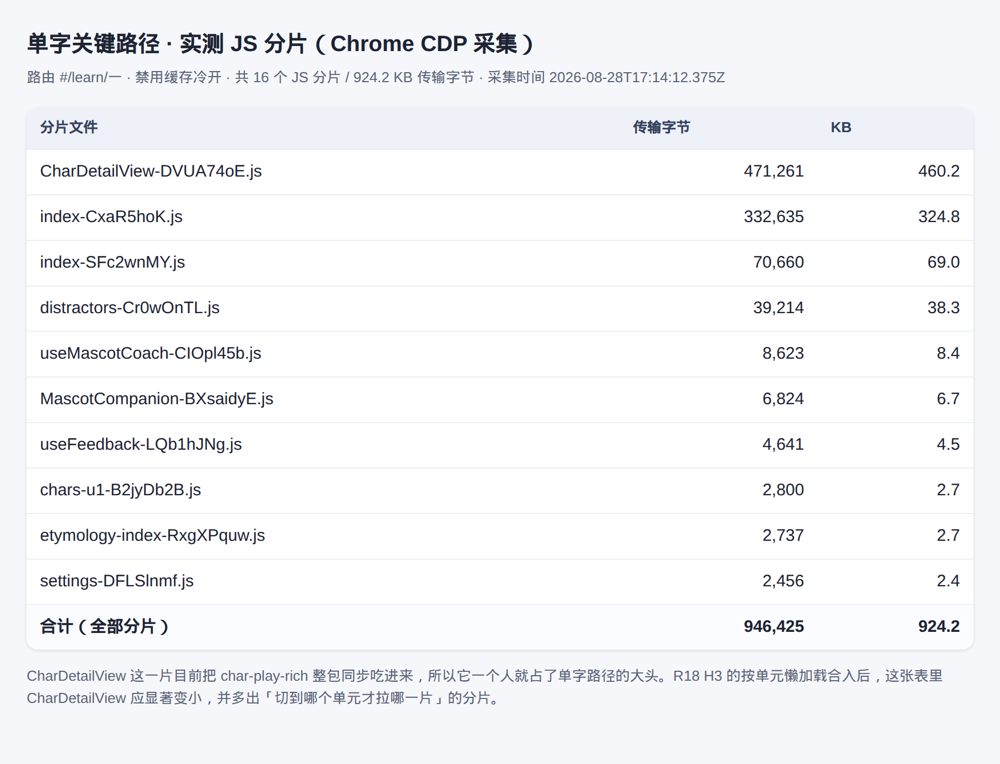
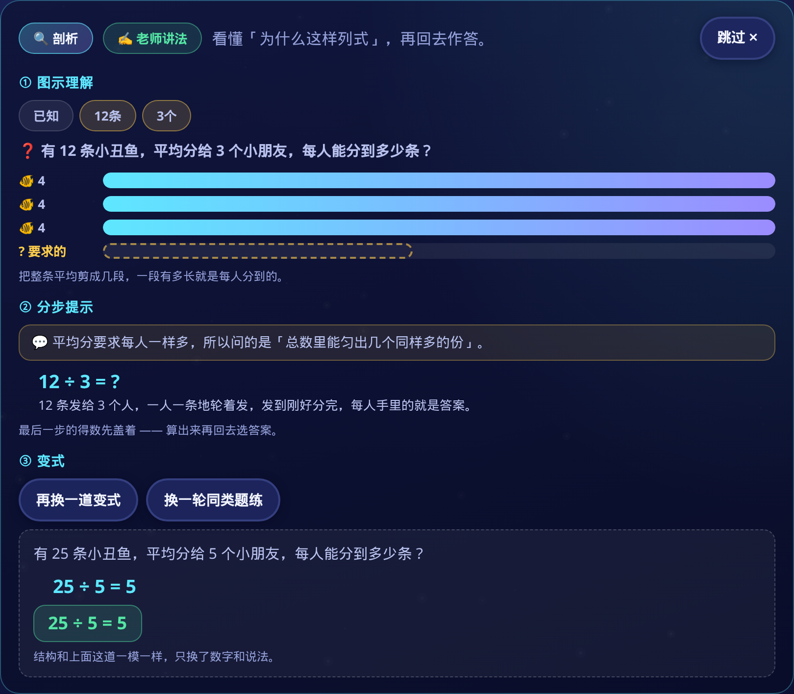
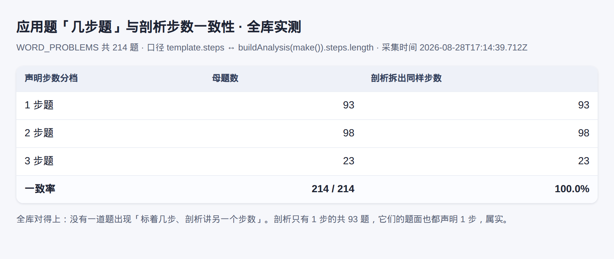

# Round 18 · H6 走查证据包

> 分支 `cursor/r18-walkthrough-bundle-9f67`，走查的树 = 本分支 `e12de03`
> （`origin/cursor/r18-orchestration-9f67` 的 `70daca7` 合进来之后），在
> `/tmp/wt-r18-walk` 这个独立 worktree 里跑的。
> 截图机 `scripts/walkthrough-shots-r18.mjs`，一条命令重跑：`npm run walkthrough:shots:r18`。
> 原始清单（每张图的说明、落盘字节数、两张实测面板的全部原始数字）：
> `evidence/r18/walkthrough-shots.json`。

## 这一包拍的是哪棵树

跑过两遍，图和数都是**第二遍**（合入后复测）的：

| 走查 | 树 | 富玩 | 步数一致率 | 单字路径 |
| --- | --- | --- | --- | --- |
| 第一遍（起点） | orchestration `19cb7cc` | 940 / 1820 | 158/214 = 73.8% | 861.3 KB / 16 片 |
| **第二遍（本包）** | 本分支 `e12de03` | **1240 / 1820** | **214/214 = 100%** | **924.2 KB / 16 片** |

第二遍的树上，H2（富 Play 1240）、H4（步数对齐）、H5（精品剖析 85）都已经合入，
**H3 拆包还没有**——`cursor/r18-play-codesplit-9f67` 当时还没并进编排分支，
`char-play.js` 仍然 `import * as richModule` 整包同步吃 rich。所以单字关键路径不但没瘦，
反而跟着富脚本从 940 涨到 1240 一起涨了 63 KB。**这一格必须在 H3 合入后用同一条命令
复测**；在那之前谁也别拿这一包声称 H3 达标。第一遍的图不再保留（同名覆盖），
原始读数留在上面这张表和 git 历史里（`8934f33`）。

## 这份东西是怎么产生的

`npm run build` 出两个 App 的 dist，脚本给它们各挂一台本地静态服务，再用真
Chrome（148.0.7778.96 / Node v22.14.0，headless）**从入口一路点进去**，
到值得看的画面就落一张 PNG。不是对着组件单独渲染，也不是把设计稿导出来。

其中两张不是页面截图，是**实测面板**：

- `r18-04` 的表来自 CDP 的 `Network.responseReceived` / `Network.loadingFinished`
  事件——禁缓存冷开一次单字详情，逐片记 `encodedDataLength`；
- `r18-06` 的表来自本进程直接 `import` 了 `wordProblems.js` 和 `wpAnalysis.js`，
  把 214 道母题各实例化一次、跑一遍 `buildAnalysis`，再和 `template.steps` 比。

两张表里每个数字都是这一次运行量出来的，渲染成表格再拍照，没有手搓的图。

家长周报那张**故意排在最后**：剖析那一幕答的 8 道题会真的落进本机存档，
周报读的就是那一份，所以卡上「做了 8 道题」是走查自己攒出来的；
也因此数学侧全程共用一个浏览器上下文，中途不清 localStorage。

## 四类场景

### ① 富玩：手写富脚本的玩关，和还没轮到的那批字

走法：脚本先 `import` 一遍 `char-index` 与 `char-play`，按 `hasRichPlay()` 把字表切成
两拨，各取一个字进 `/#/learn/<字>`，清存档重载，从步骤条点到第 1 步「玩一玩」。



第 40 单元之后取到的「驰」：`data-play-template=swipe-motion`、
**`data-fallback=false`**（这一位是脚本的硬断言，取到回填关直接报错退出），
旁白「骏马撒开腿，飞驰起来。」——要往右推 3 下马才跑得起来，
玩法本身在讲「驰」的字义，不是套一个通用找茬。


对照组「纫」：**`data-fallback=true`**、模板 `pair-match`，旁白
「穿针缝东西。把『纫』和它的图连起来。」——连线题，靠图配字，不解释字义。

实测覆盖：**富脚本 1240 条 / 字表 1820 字，旁白去重 1240 句**（口径
`countRichPlays()` / `richPlayCoverage()`）。H2 的 ≥1200 已经过线，但字表还有 580 字
落在模板回填层，`r18-02` 就是它们的样子——这不是失败截图，是下一轮的活。

### ② 拆包：单字关键路径现在到底吞了多少

走法：新开一个禁用缓存的页面挂上 CDP 网络监听，冷开 `/#/learn/一`，
等页面 idle 后回到顶部拍首屏，再把这次真正下载的 JS 分片列成表。


首屏就是孩子每天点最多的那一页：步骤条 🎮玩 → 👀认 → 👂练 → ✍️写 → 🗣️说，
第 1 步「玩一玩」直接展开，下面接「这个字的来历」。



实测：**16 个 JS 分片、合计 924.2 KB 传输字节**，其中

| 分片 | 传输字节 |
| --- | --- |
| `CharDetailView-*.js` | 471,261（460.2 KB） |
| `index-*.js`（应用主包） | 332,635（324.8 KB） |
| `index-*.js`（次包） | 70,660 |
| `distractors-*.js` | 39,214 |

`CharDetailView` 一个人占了单字路径的 **51%**，因为 `char-play.js` 顶上那句
`import * as richModule` 把 `char-play-rich` 整包同步吃进来，不分单元；
富脚本从 940 写到 1240 之后，这一片从 397 KB 涨到 460 KB。
这正是 H3 要治的「不再整包同步进单字关键路径」。走查当天 `check:round18` 的 H3 原话是
「整包静态 import=2 处（`char-intro.js`、`char-play.js`），分片=0」。
**H3 合入后复跑这一幕**：这张表里 `CharDetailView` 应显著变小，并且多出「切到哪个单元
才拉哪一片」的分片——表是同一张表，一比就知道拆没拆干净。

### ③ 剖析：面板长这样，步数现在对得上了

走法：进 `/#/word-problems`，点题面上的「🔍 剖析」，试着点「全部摊开」，
再点「看一道同结构的变式」。



这一轮抽到的是「12 条小丑鱼平均分给 3 个小朋友」：① 图示理解把 3 份条形画出来，
问句和「要求的」那一段用虚线框住；② 分步提示先讲「平均分要求每人一样多，
所以问的是『总数里能匀出几个同样多的份』」，再列 `12 ÷ 3 = ?`，
**末步得数按设计盖着**（面板自己写了「算出来再回去选答案」）；
③ 变式换成 `25 ÷ 5 = 5`，结构一样只换数。右上角「跳过 ✕」全程在，
看完剖析接着答了 8 题，答题链路没被面板卡住。



全库跑一遍：**`template.steps` 与 `buildAnalysis().steps.length` 214/214 全对，
一致率 100%**（分档看：1 步题 93 道、2 步题 98 道、3 步题 23 道，各档都全中）。
第一遍走查时这里是 158/214 = 73.8%，不一致的 56 道集中在 `sum-times-*`
（声明 3 步、实际拆出 2 步）和 `div-remainder`（2→1）；H4 合入后这两族都收掉了。
「剖析只有 1 步」的还有 93 道，但它们的题面本来就声明 1 步，属实，不是缩水。

### ④ 周报与学伴


进 `/#/parent`，读题面上的口算门算出答案过门。`data-weakness="thin"`：
「这周来了 1 天 · 共 0 分钟 · **做了 8 道题** · 弱项判定：来的天数太少」——
这 8 道就是第 ③ 幕答的那 8 道，周报读的是真存档。下面三条建议各自可点，
卡底印着「这段话是按本机存档现算的：没有联网，也没有拿别的孩子做对比」。


识字首页点一下学伴，气泡说「有 2 个老朋友在等你，先去打个招呼吧。」
这句会随存档换（同一天另外几次运行说的是「复习不是重学一遍，是把快忘的字捞回来」
和「今天把它们复习完，明天它们就不容易跑掉了」），说明台词是按进度挑的，
不是写死的一句。

## 走查里发现的问题

**1. 富脚本涨了，首包跟着一起涨。** H2 把 940 写到 1240 是好事，但在 H3 落地之前
每多一条富脚本，单字关键路径就多背一份字节：这一轮实测从 861 KB 涨到 924 KB，
`CharDetailView` 占比从 46% 升到 51%。两件事必须成对看——**H2 越成功，H3 越要紧**。

**2. 模板回填关不认字义。** 「纫」那一关是 `pair-match` 连线，题面只说「把『纫』和
它的图连起来」，玩完孩子记住的是图不是字。字表里还有 580 个字是这样。

**3. 单场走查判不出 `thin` 以外的周报分支。** 弱项规则里 `thin` 的条件是
「活跃 ≤2 天且 <25 分钟」，优先级排在错题欠账、正确率偏低之前；一场走查只落在一天里，
所以无论答多少题、错多少题都必然判 `thin`。这张图能证明的是「周报读的是真存档、
数字对得上、建议可点」，**不能**证明其它分支的文案——那几条由 `npm run test:mascot`
用构造存档覆盖，不在本包里。

**4. 周报的「共 0 分钟」。** 8 道题答下来时长仍记 0 分钟，说明时长统计在这种短会话里
会归零。没往下追，记在这里备查。

## 边界（这份包不能证明什么）

- **不能证明 H3 达标**：单字路径那一格记的是拆包合入前的读数，而且比起点更差。
- 全程 headless Chrome + 本地 dist，**不是真机**。Android 侧归 H7 管，与本包无关。
- 无音频：跑的时候带了 `--mute-audio`，跟读、旁白配音、音效都没有验证。
- 每张图都是**这一次**运行的产物。应用题抽哪道、学伴说哪句跟当时的存档和随机题序
  有关，重跑会换一道题；但走的路径、读的 `data-*` 契约、两张实测表的口径是固定的。
- 富玩那两张各取一个字为样本，证明的是「手写关确实是手写的、回填关确实还在」，
  不代表 1240 条条条都好玩——覆盖数走 `check:round18` 的 H2，不走这一包。

## 复现

```bash
npm run build                       # 出两个 App 的 dist
npm run walkthrough:shots:r18       # 落 8 张 PNG + walkthrough-shots.json 到 evidence/r18/
npm run walkthrough:shots:r18 -- play-rich wp-steps   # 只跑其中几幕
```

需要本机有 Chrome/Chromium（脚本按 `CHROME_PATH` → `/usr/local/bin/google-chrome`
→ `/usr/bin/chromium` 的顺序找）。任何一幕的契约断言没过（比如富玩那一幕取到了
回填关），脚本会把它记进 `failures` 并非零退出，不会留下一份「看着挺全」的假证据。

## 探针

走查当天在这棵树上跑 `npm run check:round18`（v1.0）：**5/8**

```
✓ H1 Round18 差距续表就位（双基线 + 本轮归属）
✓ H2 富 Play 1240 ≥ 1200，narration 去重 1240 ≥ 960（可执行标记 ×3）
✓ H4 步数对齐 214/214 = 100.0% ≥ 90%（题库 ≥200，可执行标记 ×2）
✓ H5 精品剖析 85 ≥ 80（去重中文讲解句 241 ≥ 200，可执行标记 ×3）
✓ H6 走查证据包就位（引用 8，落盘 8 ≥ 4，场景 4/4）
✗ H3 拆包未达标（整包静态 import=2 处，分片=0）
✗ H7 缺 r18 台账
✗ H8 check:round17 7/8
```

H6 是本包要交的那条，绿了；H2/H4/H5 的绿和上面几张图对得上。
H3 是 5 号子代理的活，红是本包如实记录的现状。H8 那条红要打个折扣：往下追是
`check:round16` 的 H8 → `check:round13` 的 APK SHA256 比对，而
`apps/*/android/app/build/outputs/apk/debug/app-debug.apk` 是 gitignore 掉的构建产物，
新开的 worktree 里本来就没有，`npm run android:sim` 重建一次就回来。跟本包无关。

## 文件清单

| 文件 | 覆盖 | 字节 |
| --- | --- | --- |
| `evidence/r18/r18-01-play-rich.png` | ① 富玩·手写富脚本玩关「驰」（`data-fallback=false`） | 127,013 |
| `evidence/r18/r18-02-play-template-gap.png` | ① 富玩·模板回填缺口「纫」（还剩 580 字） | 120,304 |
| `evidence/r18/r18-03-char-detail-single-char.png` | ② 拆包·单字详情冷开首屏 | 290,738 |
| `evidence/r18/r18-04-bundle-network.png` | ② 拆包·单字关键路径 JS 分片实测（CDP，924.2 KB） | 229,033 |
| `evidence/r18/r18-05-wp-analysis.png` | ③ 剖析·图示 + 分步 + 变式 | 753,821 |
| `evidence/r18/r18-06-wp-steps-audit.png` | ③ 剖析·全库步数对齐实测（214/214） | 105,931 |
| `evidence/r18/r18-07-math-parent-weekly.png` | ④ 周报·数学家长中心（做了 8 道题） | 587,342 |
| `evidence/r18/r18-08-literacy-mascot.png` | ④ 学伴·识字首页气泡 | 37,505 |
| `evidence/r18/walkthrough-shots.json` | 每张图的说明、字节数与两张实测面板的原始数据 | — |
| `scripts/walkthrough-shots-r18.mjs` | 截图机本身 | — |
