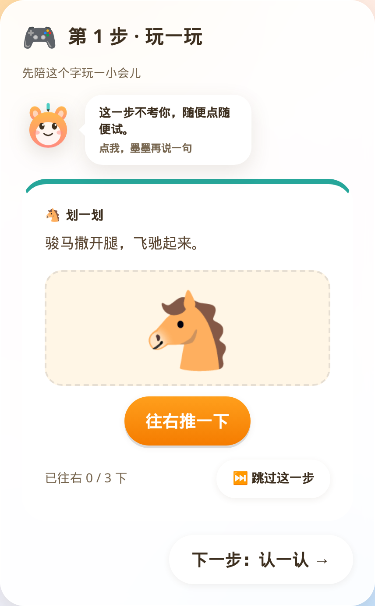
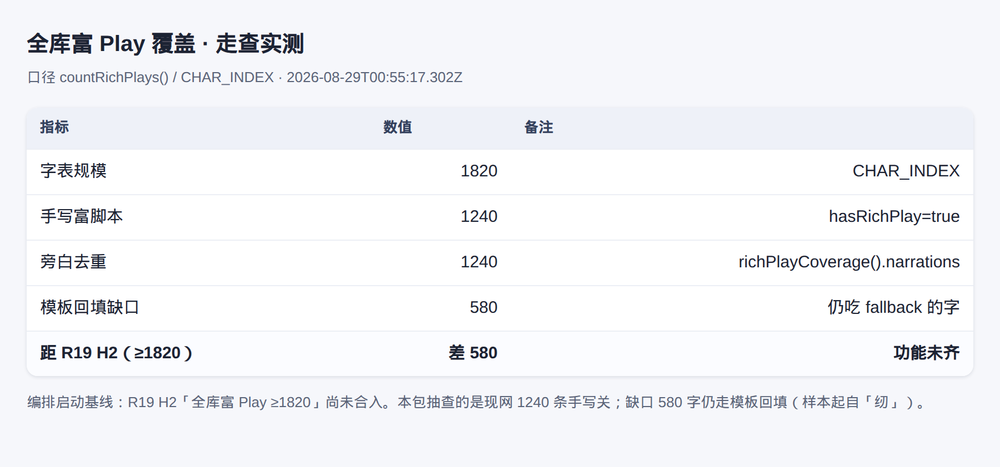
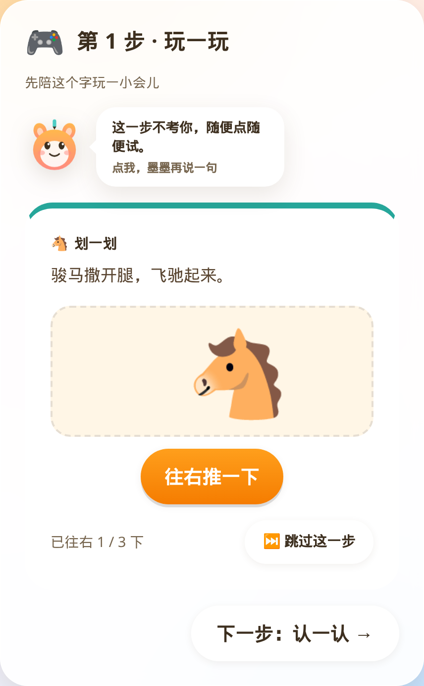
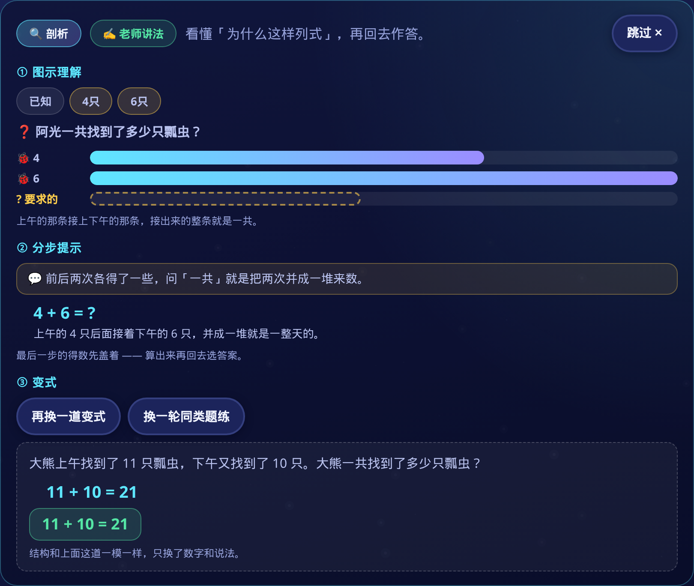

# Round 19 · H6 走查证据包

> 分支 `cursor/r19-walkthrough-bundle-9f67` ← `origin/cursor/r19-orchestration-9f67`（`2624e06` 编排启动基线），
> 在 `/tmp/wt-r19-walk` 独立 worktree 里跑。
> 截图机 `scripts/walkthrough-shots-r19.mjs`；本包接的是已起的 preview
> `http://127.0.0.1:4173`（识字）/ `:4174`（数学），真 Chrome 148.0.7778.96 headless。
> 原始清单：`evidence/r19/walkthrough-shots.json`。

## 这份包拍的是哪棵树

编排刚启动：**H2 全库富 Play、H3 精美度、H4 视频级剖析播放器、H5 精品剖析扩库
都还没合入。** 本包不假装它们绿了——四类场景都用真页面拍下来，未齐的在图注和正文
里写清楚。覆盖数仍是 R18 收口线：**富脚本 1240 / 字表 1820，距 R19 H2 全库差 580**。

| 场景 | R19 目标 | 本包实测 | 齐？ |
| --- | --- | --- | --- |
| 全库富玩抽查 | H2 ≥1820 手写关 | 1240 / 1820，抽「驰」`fallback=false` | **未齐** |
| 精美舞台 | H3 精美度升级 | 基线 `swipe-motion` 舞台，推了 1/3 | **未齐** |
| 剖析播放器 | H4 视频级 | 静态剖析面板；无 `<video>`/时间轴 | **未齐** |
| 周报 / 学伴 | 读真存档 | 周报「做了 8 道题」；学伴气泡可读 | 基线可用 |

## 怎么产生的

`PREVIEW_LITERACY` / `PREVIEW_MATH` 指向本地 vite preview，脚本用 puppeteer-core
挂真 Chrome，从 hash 路由一路点进去落 PNG。不是组件单渲，也不是设计稿导出。
覆盖率那张（`r19-02`）是本进程 `import` 字表 + `loadAllRichPlays()` 后当场数出来的
实测面板。家长周报故意排在剖析之后：剖析幕答的 8 道题落进同一浏览器上下文的
localStorage，周报读的就是这份存档。

## 四类场景

### ① 全库富玩抽查

走法：装齐 70 个富脚本分片，按 `hasRichPlay()` 取靠后单元的手写关，进
`/#/learn/驰`，清存档重载，点到「玩一玩」。



「驰」：`data-play-template=swipe-motion`、**`data-fallback=false`**，旁白
「骏马撒开腿，飞驰起来。」——往右推 3 下马才跑起来，玩法在讲字义。



当场量出来：**1240 条手写 / 1820 字表，旁白去重 1240，模板回填缺口 580**。
R19 H2 阈值是 ≥1820，**差 580，功能未齐**——这张表就是下一轮 H2 要翻掉的账本，
不是失败截图。

### ② 精美舞台

走法：同一关把玩关面板滚到视口中央，点一次「往右推一下」，进度到「已往右 1 / 3」
再拍舞台面板。



舞台上是马头道具、橙色主按钮、可跳过、墨墨旁白——这是编排启动时的基线外观。
**R19 H3「精美度升级」尚未合入**；合入后应重跑本幕对照动效、材质和节奏，
本包只证明「舞台现在长这样」。

### ③ 剖析播放器

走法：进 `/#/word-problems`，开「🔍 剖析」，试「全部摊开」与「看一道同结构的变式」。
脚本额外探了 `<video>`、时间轴文案、播放按钮——三项全无。



本轮抽到「12 条小丑鱼平均分给 3 个小朋友」：① 图示三条等分条；② 分步提示
`12 ÷ 3 = ?`，末步得数按设计盖着；③ 变式换成 `20 ÷ 4 = 5`。右上角「跳过 ✕」
全程在。**未检出视频级播放器——R19 H4 未齐**；拍的是现有静态剖析壳。
看完剖析接着答了 8 题，链路没被面板卡住。

### ④ 周报与学伴


进 `/#/parent`，过口算门。`data-weakness="thin"`：
「这周来了 1 天 · 共 0 分钟 · **做了 8 道题** · 弱项判定：来的天数太少」——
8 道就是第 ③ 幕答的，周报读的是真存档。卡底写着按本机存档现算、没有联网对比。


识字首页点学伴，气泡「有 1 个老朋友在等你，先去打个招呼吧。」——台词随存档变，
不是写死的一句。

## 走查里诚实记下来的

1. **H2 全库还差 580。** 1240 是 R18 收口线；R19 要铺到 1820，缺口字仍吃模板回填。
2. **H3 / H4 都还没影子。** 舞台仍是基线皮肤；剖析仍是静态面板，没有播放头或时间轴。
3. **单场走查只能打出 `thin` 周报分支。** 活跃落在一天里，优先级压过错题欠账；
   其它分支靠 `npm run test:mascot` 构造存档，不在本包。
4. **周报「共 0 分钟」。** 8 道短会话时长仍归零，记在这里备查。

## 边界

- 全程 headless Chrome + preview dist，**不是真机**（真机归 H7）。
- `--mute-audio`：旁白配音、音效未验。
- 富玩抽查一个字，证明「手写关契约还在」，不代表 1240 条条条都好玩；
  全库数走 `countRichPlays()` / 将来的 `check:round19` H2。
- 应用题抽哪道、学伴说哪句会随题序和存档变；路径与 `data-*` 契约固定。

## 复现

```bash
# 已有 preview 时：
PREVIEW_LITERACY=http://127.0.0.1:4173 PREVIEW_MATH=http://127.0.0.1:4174 \
  npm run walkthrough:shots:r19

# 或自建 dist：
npm run build && npm run walkthrough:shots:r19
```

## 文件清单

| 文件 | 覆盖 | 字节 |
| --- | --- | --- |
| `evidence/r19/r19-01-rich-spot.png` | ① 全库富玩抽查·手写关「驰」 | 126,809 |
| `evidence/r19/r19-02-rich-coverage.png` | ① 全库富玩覆盖率实测（1240/1820，差 580） | 124,460 |
| `evidence/r19/r19-03-polish-stage.png` | ② 精美舞台基线（已往右 1/3，H3 未齐） | 126,643 |
| `evidence/r19/r19-04-analysis-player.png` | ③ 剖析播放器·静态面板（H4 未齐） | 718,589 |
| `evidence/r19/r19-05-math-parent-weekly.png` | ④ 周报·做了 8 道题 | 591,775 |
| `evidence/r19/r19-06-literacy-mascot.png` | ④ 学伴气泡 | 37,385 |
| `evidence/r19/walkthrough-shots.json` | 每张图说明、字节与实测 meta | — |
| `scripts/walkthrough-shots-r19.mjs` | 截图机 | — |
