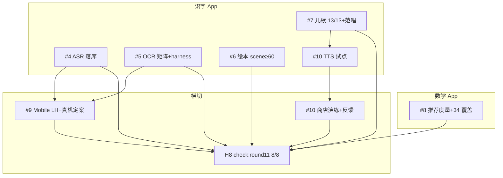

> Model slug: claude-fable-5（Round 12 子代理 #1 · `cursor/r12-arch-contracts-9f67`）

# Round 12 · 洪恩级体验全量落地架构契约

> 基线：`cursor/openmoji-integration-9f67` @ `7c2e6e7`（R11 闭合 · `check:round11` 8/8）
> 性质：**只定数据契约与 API 边界，不含实现**。功能由子代理 #4–#10 按本契约落地，
> #3/#2 按第 9 节的门禁映射验收与审计。
> 关联：`ROUND12-BRIEF.md`、`scripts/check-round12.mjs` v1.0、`round11-architecture.md`、
> `round11-hongen-audit.md` §5「R12 归属」（7 项深度债 + 3 横切债全部在本文有落点，对账见 §11）。

基线八探针逐项水位（撰写时在 `7c2e6e7` 干净 worktree 实跑 `node scripts/check-round12.mjs`）：

| 探针 | 基线状态 | R12 目标 |
|---|---|---|
| H1 ASR 落库 | ✗ files=`[]`、available=false、marked=false | 模型自托管进 `files[]` + sha256/bytes；儿童冻结集跑分；Go/No-Go 更新；`ROUND12_H1` |
| H2 OCR 系统化 | ✗ real=**6**/8、tier=false、harness=false | real 去重 ≥8 + 光照×角度矩阵 tier + 真机 harness 实体 + `ROUND12_H2` |
| H3 绘本铺开 | ✗ scenePages=**20**/60 | scene 页 ≥60（≥2 元素/页）+ `ROUND12_H3` |
| H4 儿歌全库 | ✗ audio=**8**/13、vocal=false | 13/13 去重音频 + 范唱人声试点 + `ROUND12_H4` |
| H5 推荐度量 | ✗ metrics/coverage/smoke 全 false | 掌握度 lift / 采纳率实体 + 开练覆盖 34 节点 + `ROUND12_H5_SMOKE` |
| H6 真机/LH | ✗ mobileLh=0/2、device=false | `evidence/r12/` mobile LH ≥2 份 + 真机通道三选一定案文档 |
| H7 TTS/发布 | ✗ tts=false、release=false（feedbackRun=true） | TTS 试点资产/接线 + 商店提交演练 + 反馈回路运行说明 |
| H8 R11 不退化 | ✓ check:round11 8/8 | 每分支合并前保持 |

---

## 0. 总原则（对 Round 12 全部交付生效）

### 0.1 探针即契约，匹配细节先点名

`scripts/check-round12.mjs` v1.0 已合入基线，固定 8 项输出，升 v1.1 归 #3 且**只许
加严**。逐行读探针源码得出的易踩细节：

- **剥注释口径**：H1 对 `test-asr-eval-set.mjs`、H2 对 `test-ocr-accuracy.mjs`、
  H3 对 `books.js` + `books/*.js` + literacy smoke、H4 对 `songs.js` + literacy smoke、
  H5 对 `skill-practice.js` + `progress.js` + `ParentView.vue` + math smoke，一律先
  `stripComments` 再匹配——**所有标记词必须落在代码里**；
- **无后缀豁免的标记**：H2 `/\bROUND12_H2\b/`、H3 `/\bROUND12_H3\b/`、
  H4 `/\bROUND12_H4\b/`、H5 `/\bROUND12_H5_SMOKE\b/`——词边界后跟下划线不算边界；
  H1 认 `/\bROUND12_H1(_SMOKE)?\b/` 三种落点（manifest / harness / smoke）；
- **H1 双路径**：`(filesOk || available) && gonogoOk && marked`——**files[] 落库与
  available:true 二选一即可过探针**，但契约要求 files[] 真落库；available 翻 true
  仍须 Go/No-Go 五层全 Go（§1.5），不得跳过跑分；
- **H2 real 去重**：SHA-1 内容哈希去重，文件名须 `^real` 前缀 + PNG 魔数 + ≥4096 B；
  tier 标签可写在 `real-samples.json`（`light|angle|paper|tier` 字段）或
  `.agent_workspace/r12-ocr-matrix.md`（含「光照/角度/纸质/矩阵」字样）；
- **H3 scene 计数**：import `books.js` 后逐页数 `scene` 数组（**不是** R11 初稿的
  `scene.items` 对象形态——R11 已定型为 `page.scene[]` 元素数组）；每页
  `scene.filter(el => el && typeof el === 'object').length ≥ 2`；
- **H4 音频去重**：`Set` 按 public 路径去重，≥10240 B；13 首各一文件，禁止两首歌
  指向同一路径凑数；
- **H5 coverage 腿**：`skill-practice.js` 或 math smoke 须含 `ROUND12_H5` 或
  `dailyFocus.*34|全图谱|allSkills` 信号——意为 **34/34 节点 daily 专项或等价落点**；
- **H6 mobile LH**：`evidence/r12/*.json` 一层目录，`formFactor === 'mobile'` 或
  文件名含 `mobile`；定案文档 `.agent_workspace/r12-android-device-decision.md` ≥800 字
  且含「三选一/定案/云真机/Android QA/发布决策/evidence/r12」；
- **H7 三腿 AND**：TTS 试点（`public/audio/tts-pilot/` 或 `offlineTts.js` >300 行或
  `r12-tts-pilot.md`）+ 商店演练（`r12-store-submission-drill.md` 含 `ROUND12_H7` 与
  日期/SHA/版本）+ 反馈运行（`FEEDBACK-LOOP.md` 含运行/SLA/issue 字样——基线已 true）。

### 0.2 v1.1 加严清单（#3 的活，功能方按加严后口径交付）

1. **H1 files[] 实文件校验**：manifest 每项 `path/sha256/bytes` 与 `public/asr/models/`
   实测一致；整包 `sum(bytes) ≤ 60 MiB`；dist 首屏 precache 零模型字节；
2. **H1 跑分实跑**：`test-asr-eval-set.mjs --run-model`（或等价）退出码 0 且输出
   Go/No-Go 文本层指标；禁止空壳 `gonogo=true` 仅靠 r11 文档长度；
3. **H2 tier 行为级**：`real-samples.json` 每条须含 `light`/`angle`/`paper` 三维标签
   且矩阵覆盖 ≥8 个不同组合（文档与 JSON 交叉校验）；
4. **H2 harness 实跑**：`test-ocr-device.mjs` spawn 退出码 0（VM 可 mock adb；真机项
   标 `[SKIP owner: Android QA]` 但不许缺 harness 实体）；
5. **H3 体积 Δ 断言**：60 页 scene 增量 gzip ≤ **48 KiB**（见 §0.3）；`verifyScenes()`
   零错 + 正文/注音逐字不动；
6. **H4 魔数 + 范唱**：13 首抽验 OggS/ID3；范唱试点须至少 1 首含 `vocalUrl` 或
   `r12-songs-vocal-pilot.md` 记录盲测结论；
7. **H5 度量可复算**：`r12-reco-metrics.md` 含可复现公式（lift = 采纳组掌握度 Δ − 对照组 Δ）；
   progress store 或 parent 视图有 `data-reco-lift` 观测点；
8. **H6 趋势联动**：mobile LH 两份须引用 R11 预算表路由，差分只许同 profile；
9. **H7 反馈运行**：`FEEDBACK-LOOP.md` 追加「R12 运行记录」段含至少 1 条模拟/真实工单
   闭环样例（日期 + issue 号 + 处理结论）。

### 0.3 包体预算红线

| 资产域 | 上限 | 计量口径 | 归属 |
|---|---|---|---|
| **ASR 模型整包** | **≤ 60 MiB** | `manifest.files[].bytes` 求和；F3 freezeChecklist 硬断言 | #4 |
| 识字入口 JS | < **420 KiB** gzip | literacy `check-bundle.mjs`（继承 R11） | 全体 |
| 识字 zip | < **10 MiB** | 含 ASR 模型时 ASR 走版本化 Cache Storage，**不进首屏 precache** | #4 |
| **儿歌 13 首旋律** | **≤ 2.0 MiB** | public 下去重音频路径求和（R11 8 首 ≈229 KiB，余量充足） | #7 |
| **儿歌范唱试点** | **≤ 512 KiB** 增量 | 1–3 首人声/高质量合成，与旋律分文件 | #7 |
| **绘本 scene 增量** | **≤ 48 KiB** gzip | 相对 R11 闭合基线（20 页）的新增 `books/*.js` 体积；≈100 B/页 × 40 页 ≈4 KiB 预期，留 10× 余量防 DSL 膨胀 | #6 |
| **TTS 试点** | **≤ 5 MiB** | 沿 R11 评估：首批古诗/儿歌各 ≥1 条离线资产或 WASM 切片 | #10 |
| 数学路由 lazy 组 | 各组上限见 `r11-perf-budget.md` | **只许收紧**；新增路由须同步改预算表 | #9 |

**ASR 与首屏隔离**：模型文件只许出现在 `public/asr/models/` + manifest `files[]`；
`offlineAsr.js` 的 `maxPackBytes = 60 * 1024 * 1024` 与 smoke 的「dist 无模型 precache」
双断言。违反任一条按破坏 H8 处理。

**绘本 scene 增量计量方法**（#6 交付时必附）：

```text
Δscene = gzip( books/core.js + books/extended.js @ R12 HEAD )
       − gzip( 同上 @ R11 闭合 SHA )
```

只计数据层增量；`BookPageScene.vue` 已在 R11 进 lazy chunk，本轮零组件增量预算。

### 0.4 纯数据红线

被 Node 门禁 `await import` 或读源码的文件——`songs.js`、`books.js` 及 `books/*.js`、
`daily.js` / `skill-graph.js` / `skill-practice.js` / `week-plan.js`——与其依赖链
禁止 Vue / 浏览器 API 顶层调用、禁止 `Math.random` 直调、禁止 import 任何 store。

### 0.5 不退化红线（R11 → R12 冻结面）

每个分支合并前 `npm test` 全绿 + `check:round11` **8/8**（= R12 H8，内含
`check:round10` 8/8 及 R9→R8 级联）。**以下 R11 交付面一个不许碰坏**：

| 冻结项 | R11 终态值 | 破坏判定 |
|---|---|---|
| 字库 / 单元 | **1820 字 / 99 单元** | 减字或未过 `check:data` |
| 绘本结构 | **132 本 / 1121 页** | 减本/减页；`pages[].text/p` 一字不改 |
| 已有 scene 页 | **20 页**（3 本：b1/b10/b14） | 删改已有 scene 坐标/元素 |
| 儿歌歌词 | **13 首 / 52 句** | `verifySongCoverage()` 非零 |
| 儿歌音频 | **8 首** sg1–sg8 | 删音频或降 `<10KB` |
| OCR 基准 | **13 张 9 tier** + real **6 张** | 合成 tier 阈值下调；旧样张字节变 |
| ASR 四档降级 | offline-asr→recognition→recording→listen-only | 升档触网；`allowRecognition` 默认关 |
| 开练三级落点 | wrongBook → daily → planet | `ROUND10_H3` / smoke 段删改 |
| 周计划 | `week-plan.js` + 家长 `[data-week-plan]` | 7 日结构或采纳痕迹语义变 |
| 路由预算 | `check-route-budget.mjs` 17 组 | 任一 lazy 组超限 |
| LH 趋势 | `evidence/r11/math-lighthouse-trend.json` | 历史原始值删改 |
| 标记词 | `ROUND11_H1`–`ROUND11_H7`、`ROUND10_H*` | 命中面减少或常量删 |
| axe / 主题 | critical/serious **0/0** | 四主题任一退化 |
| 清单诚实化 | `ANDROID-DEVICE-CHECKLIST.md` 零 `[待填]` | 回退占位符 |

**数值红线只许收紧**：OCR 阈值、ASR Go/No-Go 线、路由 gzip 上限、LH 分数下限——
放宽须回改本文档并升 ACCEPTANCE 版本。

### 0.6 存储向后兼容

- 识字 `happy-literacy:v1` 顶层形状冻结，本轮零新增域；
- 数学 `mathquest/progress` 顶层**本轮唯一新增域 `recoMetrics`**（§5.4）：
  `{ snapshots: [{ weekStart, adoptedSkills, masteryDelta }] }` 滚动保留最近 12 周；
  `defaultState()` / `mergeState()` 显式清洗；旧档缺省 `{}`；
- 数学 `weekPlan` 域（R11）逐字不动；图谱浏览路径 localStorage 只读断言继续成立。

### 0.7 并发纪律

一律 `git worktree`（`/tmp/wt-r12-<task>` 或 `.agent_workspace/r12-*-9f67/`）+
cherry-pick 合入；不切共享集成树、不在共享树留未提交文件。worktree 跑门禁前
`ln -s /workspace/node_modules`（或 `npm ci`）。package.json 写者各归一人：

- literacy `package.json`：**#4**（ASR 跑分链）、**#5**（OCR device 链）、**#7**（儿歌链）——
  须串行或事先分脚本名，禁止互相覆盖 `test` 链；
- math `package.json`：**#8**（reco metrics 链）、**#9**（LH 复测链）——同上；
- 根 `package.json` / lockfile 本轮**默认无人动**，除非 #9 需挂 `check:r12-perf`。

### 0.8 授权与合规

- ASR：自托管 + Apache-2.0 或更宽松且模型卡许可明确的量化档；**≤60 MiB**；
  `THIRD_PARTY_NOTICES.md` + SBOM 逐文件；
- 音频：CC0 / 项目自制（`generate-song-audio.py` 管线）/ 签署演播授权；**禁止**
  未授权商业曲库；
- OCR 实拍：CC BY-SA 或自摄零人脸；矩阵 log 溯源；
- TTS 试点：沿 R11 #10 结论——Piper/VITS **不进首包**；试点须独立许可审查记录。

### 0.9 全程离线

CI 零联网：ASR/OCR harness 用仓库内资产；真机 harness 在 VM 可 mock adb exit 0；
TTS 试点资产须入库后离线可播；LH 证据 JSON 本地生成归档。

---

## 1. 契约一 · ASR 模型落库 + 儿童冻结集跑分（H1，所有者 #4）

### 1.1 模块边界

```
┌─────────────────────────────────────────────────────────────┐
│  FollowReadView / useSpeechEval                              │
│       ↓ 四档降级（R10/R11 冻结，只许往下降）                  │
│  offlineAsr.js ← manifest.json ← public/asr/models/*       │
│       ↓ Worker                                               │
│  sherpaAsrWorker.js（wasm-worker，不进首屏 precache）         │
└─────────────────────────────────────────────────────────────┘
         ↑ 评测闭环（不触网）
  test-asr-eval-set.mjs ← asr-eval-set.json
         ↑ 治理
  r12-followread-ship.md（Go/No-Go 实测值 + ROUND12_H1）
```

**依赖**：#4 不依赖其他 R12 功能分支；**被依赖**：#9 真机基准（F7 性能层）须在
ASR 模型到位后测 RTF。

### 1.2 探针拆解

H1 = `(filesOk || available)` && `gonogoOk` && `marked`。
- `filesOk`：`files[]` 至少一项含 `path`/`sha256`(64 hex)/`bytes`>0；
- `gonogoOk`：`r12-followread-ship.md` >600 字 **或**（`r11-followread-gonogo.md` >800
  且含 `ROUND12_H1|模型落库|files[]|available`）；
- `marked`：`ROUND12_H1` 落在 manifest / harness / smoke 之一。

### 1.3 落库契约：`public/asr/manifest.json` + `public/asr/models/`

`files[]` 条目 schema（冻结）：

```jsonc
{
  "path": "asr/models/encoder.int8.onnx",  // 相对 literacy public/
  "role": "encoder|decoder|joiner|tokens|config",
  "bytes": 12345678,
  "sha256": "64位小写hex",
  "quant": "int8|fp16|fp32"
}
```

- **整包 `sum(bytes) ≤ 62914560`（60 MiB）**；超出须换量化档或拆「家长可选下载包」
  （可选包不计入首包探针，但 `available:true` 仍要求首包 ≤60 MiB 或显式 No-Go）；
- `modelVersion` 从 `unfrozen` 前进为 semver（如 `1.0.0`）；换模型必须重跑冻结集；
- `license` 非空；F1/F2 checklist 项标 `done` 须有 evidence 指针；
- 允许追加 `evalRun: { at, quietCharRecall, noisyCharRecall, … }` 指针，指向
  `.agent_workspace/evidence/r12/asr-eval-run.json`。

### 1.4 跑分契约

- 扩展 `test-asr-eval-set.mjs`：新增 `--run-model`（或默认 CI 链）spawn Worker
  对 `entries` 中 `status=scripted` 条目跑**自转写基线**（R11）+ 真模型路径
  （R12）双模式；真模型模式输出 Go/No-Go 各层 `measured` 值；
- 代码级 `const ROUND12_H1 = 'asr-ship'`；
- literacy smoke 追加 `ROUND12_H1_SMOKE`：断言 `[data-model]`、`files.length≥1`
  或 `available===false` 时 `[data-tier]` 仍合法；**全程零跨源请求**；
- `.agent_workspace/r12-followread-ship.md`（#4 独占）：记录选型档、files[] 快照、
  跑分命令、实测指标、**available 建议**（Go 才建议 true）。

### 1.5 available 翻转条件（继承 R11 §1.3，一条不放宽）

`available:true` **仅当** F1–F5 + F7–F10 全 `done` 且 Go/No-Go `verdict=go`。
F6（声调诊断）不阻塞 available，但阻塞逐字声调 UI。探针允许 `available:true`
单腿过 H1，**编排终验仍要求 files[] 实体在场**——不许「空 available」。

### 1.6 红线

- 四档降级语义、隐私「只许往下降」、模型不进 precache——R10/R11 冻结；
- 儿童冻结集：跑分用 R11 `asr-eval-set.json` 条目，**禁止**偷换成人朗读集；
- 无授权模型 / 超 60 MiB / 许可证不明 → 保持 `available:false`，files[] 可落库供评测。

---

## 2. 契约二 · OCR 矩阵系统化 + 真机 harness（H2，所有者 #5）

### 2.1 模块边界

```
CameraOcrView ← useOcr.js ← utils/ocr.js
       ↑                    ↑
  ROUND11_H2 话术      test-ocr-accuracy.mjs（基准 ≥8 real）
       ↑
  test-ocr-device.mjs（真机/模拟器 harness）
       ↑
  r12-ocr-matrix.md + real-samples.json（tier 标签）
```

**依赖**：无；**被依赖**：#9 真机相机端到端（清单 §4）在定案后由 Android QA 执行。

### 2.2 探针拆解

H2 = `real≥8`（SHA-1 去重）&& `tierOk` && `harness` && `ROUND12_H2`。

### 2.3 矩阵契约

- `fixtures/ocr/real-*.png` 增至 **≥8** 张有效 PNG；`real-samples.json` 每条追加：

  ```jsonc
  { "name": "real-...", "light": "natural|warm|low|backlit",
    "angle": "front|tilt|side|perspective", "paper": "sign|wall|page|sticker|..." }
  ```

- 矩阵文档 `.agent_workspace/r12-ocr-matrix.md`：8+ 组合覆盖表 + 与 R11 6 张的增量说明；
- `test-ocr-accuracy.mjs`：`ROUND12_H2` marker + real tier 最小张数常量 **8**；
  保留 `supersedes: 'ROUND11_H2'/'ROUND10_H2'` 链；**既有 13 张合成 + 6 张 real
  阈值只许上调**。

### 2.4 真机 harness 契约

- 新脚本 `apps/literacy-app/scripts/test-ocr-device.mjs`（#5 独占）：
  - VM 模式：mock `adb devices` / WebView 协议，断言 harness 协议完整（退出码 0）；
  - 真机模式：`[SKIP owner: Android QA]` 项输出 SKIP 计数但不 fail；
  - 代码级 `const ROUND12_H2_DEVICE = 'ocr-device-harness'`；
- 文档 `.agent_workspace/r12-ocr-device-harness.md`：adb 命令表、权限三路径、
  wasm 耗时采样协议、拍照方向用例——供 Android QA 按清单 §4 执行。

### 2.5 红线

- 识别参数 / `preprocess()` 链冻结；合成 tier 不删；
- 失败话术 R11 分支保留；`ROUND11_H2` / `data-ocr-empty` 观测点不退化。

---

## 3. 契约三 · 绘本场景批量铺开（H3，所有者 #6）

### 3.1 模块边界

```
BookReadView → BookPageScene.vue → sceneOfPage(page) ← books.js
                              ↑
                    books/core.js + books/extended.js（scene[] 数据）
                              ↑
                    verifyScenes() / check-data.mjs
```

**依赖**：R11 `BookPageScene.vue` + DSL 冻结；**与 #10 关系**：朗读音质归 X1，scene
数据层不等待 TTS 试点。

### 3.2 探针拆解

H3 = `scenePages≥60` && `/\bROUND12_H3\b/` 命中 books 数据 + literacy smoke。

基线：**20 页 / 3 本** → 目标 **≥60 页**（≥40 页净增）或 **≥15 本含 scene**（探针
按页计数，本契约取 **≥60 页** 为硬杆）。

### 3.3 铺开策略

- **高频单元先行**：按字表单元 1–20 对应绘本 + 已有 b1/b10/b14 同规扩展；
- 每页 scene 沿用 R11 DSL（`scene[]` 2–6 元素、`sceneBg`/`sceneAlt`/`emoji` 兜底）；
- `books.js` 追加：

  ```js
  export const ROUND12_H3 = 'scene-rollout-60'
  export const SCENE_ROLLOUT_TARGET = 60
  ```

- 生成管线：优先 `scripts/gen-book-scenes.mjs`（#6 新建）从单元词频 + palette 模板
  批量生成，**人工抽检 10%** 页坐标；禁止手写逐页硬编码 40 页；
- literacy smoke：`ROUND12_H3` interact 段——开第一本含 scene 的书 → 断言
  `[data-book-scene]≥2` → 换一本新开 scene 书断言非空 → R11 `ROUND11_H4` 段不动。

### 3.4 体积契约

- 增量 **≤48 KiB gzip**（§0.3）；超出须减元素数或压缩 `sceneAlt` 文案；
- `.agent_workspace/r12-books-rollout-log.md`：页清单、Δ体积、表现力抽检记录；
- `pages[].text/p` **一字不动**；无 scene 书渲染路径与 R11 视觉等价。

### 3.5 红线

- 不引入位图/手绘；投稿 schema `hongen-book/1` 不动；`book-index.js` 不长胖。

---

## 4. 契约四 · 儿歌 13/13 + 范唱人声试点（H4，所有者 #7）

### 4.1 模块边界

```
SongsView → audio 文件优先 → SpeechSynthesis 兜底
              ↑
         songs.js（13 首 melody + 可选 vocalUrl）
              ↑
    public/audio/songs/* + public/audio/vocal/*（试点）
              ↑
    generate-song-audio.py（旋律）+ r12-songs-vocal-pilot.md（范唱）
```

**依赖**：#10 X1 选型（R11 录音首选）；范唱试点可与 #10 TTS 试点共用 1 条资产。

### 4.2 探针拆解

H4 = `songCount≥13` && `audioFiles≥13`（去重 ≥10KB）&& `vocalOk` && `ROUND12_H4`。

基线：**8/13 旋律** → 补齐 **sg9–sg13** 五首，同一 `generate-song-audio.py` 管线。

### 4.3 旋律全库契约

- 命名锁定：`audio/songs/<songId>-<slug>-melody.ogg`；
- `songs.js`：

  ```js
  export const ROUND12_H4 = 'thirteen-file-first-with-vocal-pilot'
  // ROUND11_H5 / ROUND10_H5 常量保留
  ```

- 13 首合计 **≤2.0 MiB**；歌词 `lines/notes/bpm` 冻结。

### 4.4 范唱试点契约

- 至少 **1 首**（建议 sg1 或 sg2）追加范唱轨：
  - 路径 `audio/vocal/<songId>-vocal.ogg` 或 `vocalUrl` 字段；
  - 来源：签署授权真人录音 **或** R11 评估通过的离线合成（须盲测记录）；
- `.agent_workspace/r12-songs-vocal-pilot.md`：选型、溯源、盲测表（≥3 人）、
  与洪恩范唱对比结论；
- `SongsView.vue`：范唱按钮纯追加，默认仍播旋律轨；不自动播放。

### 4.5 红线

- 禁止第三方商业录音；`markSongSung()` 语义不变；合成降级双轨保留。

---

## 5. 契约五 · 推荐效果度量 + 开练全图谱覆盖（H5，所有者 #8）

### 5.1 模块边界

```
SkillGraphView ── recommend() ── practiceEntry() ── daily/planet
       ↑                              ↑
  week-plan.js（R11 冻结）      skill-practice.js（ROUND12_H5 扩展）
       ↑
ParentView ← progress.recoMetrics + weekPlan.adopted
       ↑
r12-reco-metrics.md（公式 + 样例报表）
```

**依赖**：R11 周计划 / 开练三级落点冻结；**超越线**：R11 审计 §5.1-5 的「效果度量」
本轮落地。

### 5.2 探针拆解

H5 = `metricsOk` && `coverageOk` && `ROUND12_H5_SMOKE`。

### 5.3 开练覆盖扩展

基线：`canDailyFocus` 覆盖 **10/34** 节点 → R12 目标 **34/34**：

- 扩展 `daily.js` 的 `canDailyFocus(skill)` 或等价映射表，使每个 `SKILL_NODES` id
  至少有一种 `practiceEntry` 落点 **优于**「进星球首页盲找」——优先 daily 专项，
  不可出题的技能（数独等）保持 planet 但须 **planet 内深链**（query/hash 定位子模式）；
- `skill-practice.js` 追加 `export const ROUND12_H5 = 'full-graph-practice'`；
- math smoke：`ROUND12_H5_SMOKE`——遍历 34 节点断言 `practiceEntry` 非 null 且
  `kind`/`to` 合法；至少 24 个原 planet 回退项变为 daily 或 planet 深链。

### 5.4 效果度量契约

`.agent_workspace/r12-reco-metrics.md`（#8 独占）+ 代码实体二选一或并存：

**文档必含**：
- **掌握度 lift**：采纳组（点击推荐/周计划开练）vs 对照组（未采纳）7 日 mastery Δ；
- **采纳率**：`adoptedDays / offeredDays`（家长面板可观测）；
- 可复现公式 + 模拟数据集样例（匿名本地计数，零遥测）。

**代码实体**（推荐）：

```js
// progress store 新增域 recoMetrics（§0.6）
recoMetrics: {
  weeks: {
    [weekStartKey]: {
      offered: number,          // 展示推荐次数
      adopted: number,          // 点击开练次数
      masteryBefore: Record<skill, number>,
      masteryAfter: Record<skill, number>,
    }
  }
}
```

- `ParentView.vue` 追加 `[data-reco-lift]` / `[data-adoption-rate]` 观测点（口算门内）；
- 导出 CSV 追加采纳率列（复用 R11 导出路径）。

### 5.5 红线

- `recommend()` 排序 / 理由 / 只读声明不动；`weekPlan` 域不动；
- 图谱浏览零写入（R8 断言）；聚焦练习不顶替每日任务。

---

## 6. 契约六 · Mobile LH 复测 + 真机通道三选一定案（H6，所有者 #9）

### 6.1 模块边界

```
lighthouse-ci.mjs → evidence/r12/lighthouse-*-mobile.json（≥2）
       ↑
check-r12-perf-trend.mjs（可选，对比 r11 趋势）
       ↑
r12-android-device-decision.md（三选一定案）
       ↑
ANDROID-DEVICE-CHECKLIST.md（只读引用，不改本体）
```

**依赖**：#4 ASR 真机 RTF（可选并行）；#5 OCR harness（定案后执行清单 §4）。

### 6.2 探针拆解

H6 = `mobileLh≥2` && `deviceOk`（定案文档 ≥800 字 + 关键词）。

### 6.3 Mobile LH 复测契约

- 双 App 各 1 份 **mobile** profile JSON 归档 `evidence/r12/`；
- 口径：LH 12.8.2、`formFactor=mobile`、与 R9/R11 同 emulation 设置；
- 判线：Performance ≥ **0.95**（继承）；相对 R11 mobile 退化 ≤ **3 pp** / 指标 ≤ **10%**；
- 若 ASR 模型合入后 LH 降分，须在本契约预算表登记 ASR 为「已知增量」而非 silent 退化。

### 6.4 真机三选一定案框架（R12 必须闭合）

`.agent_workspace/r12-android-device-decision.md`（#9 独占）须在 **2026-08-31 前**
（或编排指定日期）从下列三选一 **显式择一**，不允许继续「清单 honest SKIP」而不决：

| 选项 | 含义 | 最低交付物 | 后续义务 |
|---|---|---|---|
| **A. 实体设备** | Android QA 按 `ANDROID-DEVICE-CHECKLIST.md` 执行 | 低档 + 高档各 1 台；证据进 `evidence/r12/android/`；清单 §2–§7 勾选 | 每轮发版复跑；OCR/ASR/触控/blocker 入回归 |
| **B. 云真机** | 立项 BrowserStack / Firebase Test Lab / 自建农场 | 服务选型表、单价、隐私评审、CI 集成 spike、≥1 次 OCR 相机用例云跑记录 | 把清单 §4 相机项迁到云跑门禁；本地保留 VM mock |
| **C. 显式发布决策** | 承认 E5 真机维度本轮不测，上升产品/发布委员会 | 签字记录：已知风险清单（WebView/触控/温升/相机/ASR RTF）、缓解措施（桌面 LH 100、静态门禁 26/26、honest SKIP）、**接受 residual 风险发版** | 下一里程碑必须回到 A 或 B；禁止连续两轮选 C |

**决策规则**：
1. 有预算 → 优先 **A**；VM 永远替代不了 A 的 §3–§7，但可以 BLOCKED 而非 FAIL；
2. 无设备有预算 → **B** 须 2 周内出 spike；spike 失败则降级 **C** 但须书面签字；
3. 选 **C** 时 L-M9/L-M10/L-M15/M-M16 体验审计 **维持 ◐**，不得宣称「洪恩级真机等价」；
4. 定案文档须含：`decision: A|B|C`、`owner`、`evidence/r12` 指针、`reviewDate`、
   `ROUND12_H6` 标记。

### 6.5 VM 不可测项标注

凡 VM 无法执行的用例，代码/文档统一标 **`[SKIP owner: Android QA]`** 或
**`[SKIP owner: Android Build]`**——与 R10/R11 清单体例一致；**SKIP 不等于 PASS**。

### 6.6 红线

- `evidence/r8`–`r11` 只读；desktop LH 100/100/100 不退化；
- 路由预算只收紧；跨 profile 差分禁止。

---

## 7. 契约七 · TTS 试点 + 商店提交演练 + 反馈运行（H7，所有者 #10）

### 7.1 模块边界

```
offlineTts.js / public/audio/tts-pilot/*  ← 古诗 or 儿歌 ≥1 条
       ↑
r12-tts-pilot.md（试点记录 + ROUND12 结论）
       ↑
r12-store-submission-drill.md（演练 checklist + ROUND12_H7）
       ↑
FEEDBACK-LOOP.md（R12 运行段：工单闭环样例）
```

**依赖**：R11 `r11-tts-evaluation.md` 结论冻结；可与 #7 范唱共用 1 条音频。

### 7.2 探针拆解

H7 = `ttsPilot` && `releaseOk` && `feedbackRun`（三腿 AND）。

### 7.3 TTS 试点契约

沿 R11 **「高频真人录音首选」**，R12 最小落地：

- **至少 1 条**离线可播资产（古诗朗诵 or 儿歌范唱）：
  - 路径 `public/audio/tts-pilot/<id>.ogg` **或** `offlineTts.js` 接线播放；
  - 增量 ≤ **5 MiB**；许可链归档 `r12-tts-pilot.md`；
- **禁止**把 Piper 63MB 权重塞进首包；若试点 WASM，须家长显式下载 + 独立预算断言；
- Piper/VITS 仅允许「盲测附录」，不改变 R11 No-Go 结论。

### 7.4 商店提交演练契约

`.agent_workspace/r12-store-submission-drill.md`：
- 干跑 Google Play / App Store Connect 步骤（可不真提交）；
- 含 `ROUND12_H7`、演练日期、集成 **SHA**、三包 **versionName**；
- 对照 `RELEASE-CHECKLIST.md` §7 逐项勾选或标 BLOCKED 原因。

### 7.5 反馈回路运行契约

`FEEDBACK-LOOP.md` 追加 **「R12 运行记录」**：
- T0 试用启动条件、工单入口、SLA、issue 模板；
- ≥1 条闭环样例（模拟或真实）：收到 → 分类 → 修复/issue → 关闭；
- 零第三方行为分析 SDK；儿童数据默认不上传。

### 7.6 红线

- R11 三文档结论段不回改；零遥测；不真提交商店（演练 ≠ 上架）。

---

## 8. 模块依赖总图



**合并顺序建议**：#9 mobile LH（纯 evidence，无 pkg 冲突）与 #8 reco（math 数据）
可先行 → #6 绘本（纯数据大 diff，独立文件）→ #7 儿歌 + #4 ASR（literacy public
争用，**串行**：先儿歌后 ASR 或反之，禁止并行写 `package.json`）→ #5 OCR → #10 TTS/发布
（文档 + 小资产）→ #2 审计 / #3 验收。

---

## 9. 文件所有权与冲突矩阵

| 热点 | 所有者 | 隔离规则 |
|---|---|---|
| `public/asr/models/*`、`manifest.json`、`test-asr-eval-set.mjs`、`r12-followread-ship.md` | #4 | `freezeChecklist` 只许标 done；四档语义不动 |
| `fixtures/ocr/real-*`、`real-samples.json`、`test-ocr-accuracy.mjs`、`test-ocr-device.mjs`、`r12-ocr-*.md` | #5 | 旧 6 张 real 字节冻结 |
| `books/core.js`、`books/extended.js`、`gen-book-scenes.mjs`、`r12-books-rollout-log.md` | #6 | 20 页已有 scene 不改；text/p 不动 |
| `songs.js`、`public/audio/songs/*`、`public/audio/vocal/*`、`r12-songs-vocal-pilot.md` | #7 | sg1–sg8 不动；≤2 MiB |
| `skill-practice.js`、`daily.js`、`progress.js`（recoMetrics）、`ParentView.vue`、`r12-reco-metrics.md` | #8 | week-plan / recommend 不动 |
| `evidence/r12/*`、`r12-android-device-decision.md`、`check-r12-perf-trend.mjs`（可选） | #9 | r8–r11 evidence 只读 |
| `public/audio/tts-pilot/*`、`offlineTts.js`、`r12-tts-pilot.md`、`r12-store-submission-drill.md`、`FEEDBACK-LOOP.md`（追加段） | #10 | R11 TTS 结论不回改 |
| literacy `smoke.mjs` | #4 #6 #7 各追加段 | 独立 interact 段，R11 段不动 |
| math `smoke.mjs` | #8 | `ROUND12_H5_SMOKE` 纯追加 |
| 本文 | #1 | 契约变更须回改本文 |

---

## 10. 契约 → 门禁映射

| 契约 | check:round12 | 所有者 | 回归红线 |
|---|---|---|---|
| §1 ASR 落库 | H1：files[] 或 available + gonogo + ROUND12_H1 | #4 | ≤60MiB；四档/隐私不动；R11 eval 骨架不动 |
| §2 OCR 系统化 | H2：real≥8 + tier + harness + ROUND12_H2 | #5 | 旧基准阈值；识别参数不动 |
| §3 绘本铺开 | H3：scenePages≥60 + ROUND12_H3 | #6 | 20 页 legacy；Δ≤48KiB；text/p 不动 |
| §4 儿歌全库 | H4：13/13 + vocal + ROUND12_H4 | #7 | ROUND11_H5/10_H5；≤2MiB |
| §5 推荐度量 | H5：metrics + coverage + ROUND12_H5_SMOKE | #8 | 三级落点；weekPlan 域 |
| §6 真机/LH | H6：mobileLh≥2 + 定案 doc | #9 | 预算/趋势；清单本体 |
| §7 TTS/发布 | H7：pilot + drill + feedbackRun | #10 | R11 结论；零遥测 |
| 全体 | H8：`check:round11` 8/8 | 每分支 | `npm test` 全绿 |

---

## 11. R11 审计 §5 → R12 落点对账

| 审计条目 | R11 交付 | **R12 本文落点** | 体验预判 |
|---|---|---|---|
| §5.1-1 L-M9 模型真落库 | 清单+评测集+Go/No-Go | §1 #4 files[]+跑分+可选 available | 仍 ◐ 直至 available Go |
| §5.1-2 L-M10 OCR 系统化+真机 | real≥5+话术 | §2 #5 ≥8+矩阵+harness；§6 定案后相机 E2E | 样本层 ◐→✅；E5 视定案 |
| §5.1-3 L-M11 13/13+范唱 | 8/13 旋律 | §4 #7 13/13+人声试点 | 覆盖率 ✅；音色仍 ◐ 直至范唱盲测过 |
| §5.1-4 L-M5 全库 scene | 20 页/3 本样板 | §3 #6 ≥60 页 | 高频 ◐→✅；全库 132 本归后续 |
| §5.1-5 M-M1 超越线 | 周计划+家长理由 | §5 #8 34 覆盖+recoMetrics | 对标 ✅；度量超越线落地 |
| §5.1-6 L/M-M15/16 真机 | 预算+趋势 | §6 #9 mobile LH+**三选一定案** | E5 视 A/B 闭合；C 维持 ◐ |
| §5.2-X1 合成语音执行 | 评估文档 | §7 #10 试点 1 条+不改 R11 结论 | 听感 ◐ 局部收窄 |
| §5.2-X2 美术增密 | scene DSL 样板 | §3 与 §5.1-4 同项 | X2 高频段落闭合 |
| §5.2-X3 真机地基 | honest SKIP | §6.4 **三选一定案框架** | R12 最高优先级管理债 |
| §5.3 商店/反馈运行 | 骨架 | §7.4–§7.5 演练+运行样例 | C 层闭合至「可运行」 |

---

## 12. 明确不做（Out of scope）

- ASR：超 60 MiB 未获豁免、无许可模型、五层未全 Go 却改 UI 文案冒充「AI 评分」；
- OCR：儿童手写/人像、删合成 tier、为过基准调参、真机未决却删 SKIP 标；
- 绘本：132 全量 scene（本轮 ≥60 页）、位图素材、改投稿 schema、改正文注音；
- 儿歌：第三方商业曲、MV/IP 化、13 首超 2 MiB 未获预算修订；
- 推荐：改写 `recommend()` 算法、孩子侧周计划视图、远端 A/B 平台；
- 性能：降 LH/axe 阈值、跨 profile 差分、未更新预算表的新路由；
- TTS：Piper 首包、未授权 checkpoint、遥测 SDK、真商店提交；
- 真机：假装 VM 测过 adb、删清单 SKIP 不改定案、连续两轮选 C 而不升级；
- 全体：识字主存档结构变更、FSRS 参数、`evidence/r8–r11` 删改。

---

## 13. 与 R11 契约的关键差异摘要

| 维度 | R11 契约 | R12 契约（本文） |
|---|---|---|
| ASR | 零字节；评测集骨架；available 永 false | **files[] 真落库**；儿童集跑分；条件允许 available:true |
| OCR | real≥5；矩阵 log；无 device harness | **real≥8**；tier 系统化；**harness 实体** |
| 绘本 | 1 单元 5 页→20 页/3 本样板 | **≥60 页**高频铺开；Δ体积预算 |
| 儿歌 | 8/13 旋律合成 | **13/13** + **范唱试点** |
| 推荐 | 周计划+采纳；效果度量除名 | **recoMetrics** + **34/34 开练** |
| 性能 | Web 预算+趋势；真机不定案 | **mobile LH 复测** + **三选一定案** |
| TTS/发布 | 评估+清单骨架 | **试点资产** + **提交演练** + **反馈运行** |
| 包体 | 模型/TTS 零入库 | ASR **≤60MiB**；TTS 试点 **≤5MiB**；儿歌 **≤2MiB** |

**一句话**：R11 交「敢上/能测/有样板」；R12 交「孩子当场感知不到的差距显著收窄 +
真机通道必须决案 + 效果可度量」——在 **H8（R11 8/8 不退化）** 红线之上做增量。
