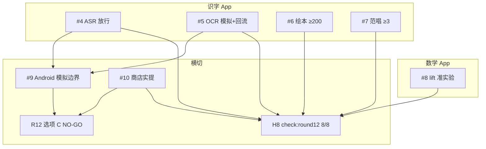

> Model slug: claude-fable-5（Round 13 子代理 #1 · `cursor/r13-arch-contracts-9f67`）

# Round 13 · 真机通道与体验终局架构契约

> 基线：`cursor/openmoji-integration-9f67` @ `7bc74c7`（R12 闭合 · `check:round12` 8/8）
> 性质：**只定数据契约与 API 边界，不含实现**。功能由子代理 #4–#10 按本契约落地，
> #3/#2 按第 9 节的门禁映射验收与审计。
> 关联：`ROUND13-BRIEF.md`、`scripts/check-round13.mjs` v1.0、`round12-architecture.md`、
> `round12-hongen-audit.md` §5.1「R13 尾巴」（7 项深度债 + 3 横切债全部在本文有落点，对账见 §11）。

基线八探针逐项水位（撰写时在 `7bc74c7` 干净 worktree 实跑 `node scripts/check-round13.mjs`）：

| 探针 | 基线状态 | R13 目标 |
|---|---|---|
| H1 ASR 放行 | ✗ available=false、freeze 文档缺失、files=true、marked=false | 儿童冻结集 ≥50 条实体 **或** `available:true` + Go/No-Go PASS + `ROUND13_H1` |
| H2 OCR Android | ✗ sim 报告已有、reflux=false、marked=false | android-sim OCR 段 PASS + 失败样本回流设计 + `ROUND13_H2` |
| H3 绘本终局 | ✗ scenePages=**105**/200 | scene 页 ≥200（≥2 元素/页）+ `ROUND13_H3` |
| H4 范唱批次 | ✗ vocal=**1**/3 | ≥3 首范唱人声资产 + `ROUND13_H4` |
| H5 lift 实验 | ✗ exp 文档缺失、smoke=false | 准实验/对照口径实体 + 导出报表趋势 + `ROUND13_H5_SMOKE` |
| H6 Android 模拟 | ✓ harness + report 已绿（基线 2/8 之一） | 维持双 APK + android-sim 报告；**明确模拟≠真机**边界 |
| H7 商店实提 | ✗ submit 文档缺失 | 真实提交/内测轨道记录 + `ROUND13_H7` |
| H8 R12 不退化 | ✓ check:round12 8/8 | 每分支合并前保持 |

---

## 0. 总原则（对 Round 13 全部交付生效）

### 0.1 探针即契约，匹配细节先点名

`scripts/check-round13.mjs` v1.0 已合入基线，固定 8 项输出，升 v1.1 归 #3 且**只许
加严**。逐行读探针源码得出的易踩细节：

- **剥注释口径**：H1 对 `test-asr-eval-set.mjs`、H2 对 `test-ocr-device.mjs`、
  H3 对 `books.js` + literacy smoke、H4 对 `songs.js` + literacy smoke、
  H5 对 `progress.js` + math smoke，一律先 `stripComments` 再匹配——**所有标记词必须落在代码里**；
- **H1 双路径**：`(available || freezeOk) && filesOk && marked`——**files[] 落库是硬前提**；
  `freezeOk` 认 `.agent_workspace/r13-asr-freeze-set.md` >800 字且含「冻结集/freeze set」
  与「≥50/条目/条数」字样；**available:true 单腿不能替代 files[]**；
- **H1 与 R12 差异**：R12 只要求落库 + 跑分骨架；R13 要求**放行**——要么冻结集实体
  ≥50 条，要么 Go/No-Go PASS 后 flip `available:true`；
- **H2 sim 报告**：`.agent_workspace/evidence/r13/android-sim/report.json` 须
  `simulated:true` 且 `ocr.pass===true`；回流设计认 `r13-ocr-regression-loop.md` >400 字
  且含「回流/regression/失败样本」；
- **H3 scene 计数**：import `books.js` 后逐页数 `scene[]` 元素数组（≥2 对象/页）；
  基线 **105 页 / 17 本** → 目标 **≥200 页**（净增 ≥95 页）；
- **H4 范唱去重**：`Set` 按 public 路径去重，≥8192 B；`vocal` 或 `vocalAudio` 字段
  须指向 `audio/` 下 `.ogg|.mp3|.wav|.m4a`；
- **H5 准实验**：`r13-reco-lift-experiment.md` >600 字且含「对照/准实验/A/B/lift/因果」；
  代码侧须含 `adoptionRate`/`recoLift` 实体 + math smoke `ROUND13_H5_SMOKE`；
- **H6 模拟报告**：`report.json` 须 `simulated:true` + 双 App `apkSha256` +
  literacy `smokeRoutes≥100`、math `smokeRoutes≥15`；harness 认 `scripts/android-sim.mjs`
  含 `ROUND13_H6`；
- **H7 实提**：`r13-store-submission-record.md` >600 字且含提交/内测/Play/TestFlight 轨道
  字样 + `ROUND13_H7` 或日期/SHA/版本。

### 0.2 v1.1 加严清单（#3 的活，功能方按加严后口径交付）

1. **H1 冻结集实条目**：`r13-asr-freeze-set.md` 须附 `asr-freeze-set.json` 或等价
   机器可读清单，**≥50 条**含 `id/text/audioPath/dualLabel`；禁止纯文档计数；
2. **H1 available 短路禁令**：若 `available:true` 则 **Go/No-Go `verdict=go`** 且
   `files[]` 非空 sha256 一致；禁止只改布尔；
3. **H1 RTF 基准**：Android 模拟或 `[SKIP owner: Android QA]` 真机 RTF 须写入
   `r13-followread-ship.md`，模拟值标 `simulated:true` 且**不得**单独触发 available；
4. **H2 回流可执行**：`r13-ocr-regression-loop.md` 须含 intake schema + 脱敏流程 +
   回归触发条件（非空壳设计稿）；
5. **H3 台账硬断言**：`ROUND13_H3` 对象含 `{ target: 200, books, pages }` 手写台账，
   `check:data` 对账 `TOTAL_SCENE_PAGES`；
6. **H4 范唱溯源**：每首范唱须 `license`/`source` 字段或 pilot 文档逐首溯源；
7. **H5 准实验可复算**：文档含 cohort 分层规则 + 混淆因子清单 + 导出 JSON 趋势字段
   `recommendationEffect.trend[]`；
8. **H6 模拟诚实性**：report 顶层 `simulated:true` 不可删；任何消费方不得把 H6 PASS
   写成「真机通过」；
9. **H7 实提可核验**：提交记录须含商店侧 track id / 内测链接 / 构建号之一（可 redact
   但不可虚构）。

### 0.3 包体预算红线（继承 R12，R13 增量）

| 资产域 | 上限 | R13 增量说明 | 归属 |
|---|---|---|---|
| **ASR 模型整包** | **≤ 60 MiB** | 基线 35.31 MiB；换版须重跑冻结集 | #4 |
| **冻结集音频** | **≤ 15 MiB** | 50 条 × ~300KB 估算；不进首屏 precache | #4 |
| **绘本 scene 增量** | **≤ 120 KiB** gzip | 相对 R12 闭合（105 页）的新增数据；≈95 页净增 | #6 |
| **范唱批次 3 首** | **≤ 1.5 MiB** | 3 × ~512KB；与旋律分文件 | #7 |
| **儿歌旋律 13 首** | **≤ 2.0 MiB** | R12 已闭合，本轮零增量预算 | #7 |
| **TTS 第二批** | **≤ 8 MiB** | 字卡/古诗 ≥1 模块离线链（横切，非 H 探针硬杆） | #10 |
| 识字入口 JS | < **420 KiB** gzip | 继承 R11/R12 | 全体 |
| 数学路由 lazy 组 | 见 `r11-perf-budget.md` | **只许收紧** | #9 |

**绘本 scene 增量计量**（#6 交付时必附）：

```text
Δscene = gzip( books/core.js + books/extended.js @ R13 HEAD )
       − gzip( 同上 @ R12 闭合 SHA 7bc74c7 )
```

### 0.4 不退化红线（R12 → R13 冻结面）

每个分支合并前 `npm test` 全绿 + `check:round12` **8/8**（= R13 H8，内含
`check:round11` 8/8 及 R10 级联）。**以下 R12 交付面一个不许碰坏**：

| 冻结项 | R12 终态值 | 破坏判定 |
|---|---|---|
| ASR 模型 | **35.31 MiB / files[] 7 项** | 删文件；sha256 不一致；整包 >60MiB |
| ASR available | **false**（R13 可 flip，须 Go/No-Go） | 无 Go 却 true |
| OCR real 矩阵 | **≥8 张 + tier 标签** | 删样张；阈值下调 |
| 绘本 scene | **105 页 / 17 本** | 删改已有 scene；`text/p` 一字不改 |
| 儿歌旋律 | **13/13 + 8KB+** | 删音频；sg1–sg8 路径变 |
| 范唱试点 | **sg5 1 首** | 删 pilot 资产 |
| 推荐度量 | **34/34 开练 + recoMetrics** | 回退 10/34；删 cohort 域 |
| mobile LH | `evidence/r12/` ≥2 份 | 删改历史 JSON |
| Android 定案 | **选项 C NO-GO** | 把模拟证据写成真机签核 |
| 标记词 | `ROUND12_H1`–`ROUND12_H7` | 命中面减少 |

### 0.5 Android 模拟 vs 真机边界（R13 横切 · 本文核心）

R12 已定案 **选项 C：显式发布 NO-GO**（`r12-android-device-decision.md`）。
R13 引入 **VM 可执行的 Android 模拟 harness**，但必须与真机证据**分目录、分语义、
分签核权**：

| 维度 | Android 模拟（H6） | 真机签核（X3 / owner: Android QA） |
|---|---|---|
| **执行环境** | Cursor Cloud VM；WebView UA + 移动视口；Capacitor `assembleDebug` | 实体设备或经批准云真机；adb 安装冻结 APK |
| **证据目录** | `.agent_workspace/evidence/r13/android-sim/` | `.agent_workspace/evidence/r*/android/` |
| **report 标记** | **`simulated: true`（强制）** | `simulated: false` 或缺省 + QA 签名 |
| **可证明项** | 双 APK 构建；SHA256；WebView smoke 全路由；OCR harness A 段；静态权限/离线断言 | 触控/温升/相机端到端/ASR RTF/蓝牙音频/进程恢复/15min 稳定性 |
| **不可证明项** | 上述真机项 —— 一律 **`[SKIP owner: Android QA]`** | 模拟器不能替代 |
| **发布效力** | **不解 NO-GO**；只闭合「工程验证链」 | 唯一可解除 `r12-android-device-decision.md` NO-GO 的路径 |
| **文案禁令** | 禁止写「真机通过」「设备签核完成」 | 禁止把 SKIP 当 PASS |

**模拟 harness 协议**（`scripts/android-sim.mjs`）：

```text
build:all → sync:android → check:android 26/26
  → gradlew assembleDebug（双 App，需 ANDROID_HOME）
  → smoke.mjs（ANDROID_SIM_UA + 移动视口）
  → test-ocr-device.mjs A 段
  → evidence/r13/android-sim/report.json
```

**消费方规则**：

1. H6 PASS **只代表**「Capacitor 包可构建 + WebView 矩阵 smoke 绿 + OCR A 段绿」；
2. L-M9/L-M10/L-M15/M-M16 体验审计 **E5 腿** 仍须真机证据或 honest SKIP；
3. ASR `available:true` 的 F7/F8 **device 腿** 模拟 RTF 可归档但**不得**单独 Go；
4. 商店实提（H7）可走内测轨道，但 **生产发布仍受 NO-GO 约束**，除非 QA 解除。

### 0.6 并发纪律

一律 `git worktree` + cherry-pick 合入。package.json 写者各归一人：

- literacy：**#4** ASR、**#5** OCR、**#6** 绘本、**#7** 范唱 —— 串行或事先分脚本名；
- math：**#8** lift 实验；
- 根/scripts：**#9** android-sim（已合入基线，维护权在 #9）；
- 横切：**#10** 商店实提 + TTS 第二批。

---

## 1. 契约一 · ASR 放行（H1，所有者 #4）

### 1.1 模块边界

```
FollowReadView / useSpeechEval
       ↓ 四档降级（R10/R11/R12 冻结，只许往下降）
offlineAsr.js ← manifest.json ← public/asr/models/*（R12 已落库 35.31MiB）
       ↓
test-asr-eval-set.mjs ← asr-eval-set.json + asr-freeze-set.json（R13 新增）
       ↓
r13-asr-freeze-set.md + r13-followread-ship.md（Go/No-Go + ROUND13_H1）
```

**R12 → R13 状态迁移**：模型已落库（`filesOk=true`），`available:false` 因 F4/F7
未闭合。R13 目标是**放行判定**——不是再落一次库。

### 1.2 探针拆解

H1 = `(available || freezeOk) && filesOk && marked`。

- `filesOk`：R12 已满足；整包 ≤60MiB；sha256 逐文件一致；
- `freezeOk`：`.agent_workspace/r13-asr-freeze-set.md` >800 字 + ≥50 条实体描述；
- `available` 路径：Go/No-Go 五层 `verdict=go` 后 flip；
- `marked`：`ROUND13_H1` 或 `ROUND13_H1_SMOKE`。

### 1.3 儿童冻结集契约（R12 尾巴 §5.1-1 首要项）

**Phase A — 骨架（R13 最小，可过 H1 freezeOk 路径）**：

- 新文件 `apps/literacy-app/scripts/fixtures/asr/asr-freeze-set.json`：

  ```jsonc
  {
    "schema": "literacy-asr-freeze-set/1",
    "targetTotal": 300,           // R13 后尾巴，本轮 ≥50
    "entries": [
      {
        "id": "cf-001",
        "text": "一二三四五",
        "audioPath": "fixtures/asr/freeze/cf-001.wav",  // 或占位 + simulated:true
        "labels": { "primary": "...", "secondary": "..." },  // 双标注
        "tier": "quiet|noisy|child",
        "simulated": false          // 占位音频须 true 且不得参与 pass 阈值
      }
    ]
  }
  ```

- **≥50 条实体**：每条含 `id`、`text`（与跟读页用字一致）、`audioPath` 或
  `simulated:true` 占位说明；
- `.agent_workspace/r13-asr-freeze-set.md`：录制协议、双标注规则、噪声 tier、
  与 R11 36 条占位集关系、**300 条终局路线图**（R13 只交 ≥50）。

**Phase B — 放行（available 路径，可选本轮）**：

- 安静集 `quietCharRecall ≥ 0.85`、噪声集 `noisyCharRecall ≥ 0.75`（继承 R11 Go/No-Go，
  只许收紧）；
- Android RTF：低端机 **RTF ≤ 1.2**（模拟可测须标 `simulated:true`，真机 F7 未测不得 Go）；
- F1–F5 + F7–F10 全 `done` → `manifest.available = true`；
- `.agent_workspace/r13-followread-ship.md` 取代 R12 ship 文档为唯一 Go/No-Go 源。

### 1.4 代码标记

```js
// test-asr-eval-set.mjs
export const ROUND13_H1 = 'asr-freeze-release-v1'
// 新增 --freeze-set 跑分；输出 quiet/noisy 实测值
```

```js
// smoke.mjs 追加段
// ROUND13_H1_SMOKE：available true 时断言 [data-tier=offline-asr]；
// false 时断言仍走 recording 档且 files.length≥1
```

### 1.5 available 翻转条件（继承 R12 §1.5，一条不放宽）

| 层级 | 条件 | R13 新增 |
|---|---|---|
| F4 儿童冻结集 | ≥50 条实体（H1）/ 300 条终局（后续） | 双标注 + 音频或 honest 占位 |
| F5 文本层 | quiet/noisy 阈值实测 | 禁止 simulated 值参与 pass |
| F7 性能 | RTF ≤1.2 | 模拟 RTF 只归档不 Go |
| F8 故障 | 五类故障 A 段 harness | device 腿 `[SKIP owner: Android QA]` |

**探针允许 freezeOk 路径不过 available**——编排终验仍要求「要么真放行，要么冻结集
实体 ≥50 + 诚实 NO-GO 理由」。

### 1.6 红线

- 四档降级、隐私只许往下降、模型不进 precache —— R10/R11/R12 冻结；
- 禁止「files 在库 = 孩子可用」文案；UI 须与 `available` 一致；
- 300 条终局、声调声学验证、换版横比 —— 明确标 R14+，不阻塞 R13 H1。

---

## 2. 契约二 · OCR Android 模拟 + 失败回流（H2，所有者 #5）

### 2.1 模块边界

```
CameraOcrView ← useOcr.js
       ↑
test-ocr-device.mjs（A 段：VM/mock；B 段：[SKIP owner: Android QA]）
       ↑
android-sim.mjs → report.json.ocr.pass
       ↑
r13-ocr-regression-loop.md（失败样本回流）
```

**与 §0.5 关系**：H2 闭「模拟层 + 回流设计」；真机相机 E2E 仍归 X3。

### 2.2 探针拆解

H2 = `simOk && refluxOk && marked`。
- `simOk`：`evidence/r13/android-sim/report.json` → `simulated:true && ocr.pass===true`；
- `refluxOk`：`r13-ocr-regression-loop.md` >400 字；
- `marked`：`test-ocr-device.mjs` 含 `ROUND13_H2`。

### 2.3 回流契约

`.agent_workspace/r13-ocr-regression-loop.md` 必含：

1. **Intake schema**：用户失败截图字段（tier 推断、设备 UA、授权状态、识别结果、
   期望文本、`consent: opt-in`）；
2. **脱敏流程**：人脸/地址/电话马赛克；CC 许可或自摄；
3. **回归触发**：每累计 N 张（建议 N=5）或 tier 空白出现时，追加
   `fixtures/ocr/user-regression-*.png` + `real-samples.json` 条目；
4. **精度门槛**：新样张纳入后 `test-ocr-accuracy.mjs` 全绿且 real tier 召回
   **≥ R12 基线**（只许上调）；
5. **Android 三路径**：Capacitor Camera / `<input capture>` / 相册 —— 模拟只测 A 段
   协议，B/C/D 标 SKIP。

### 2.4 代码标记

```js
// test-ocr-device.mjs
export const ROUND13_H2 = 'ocr-android-sim-regression-v1'
// A 段：WebView + mock 相机帧 → wasm OCR exit 0
// B 段：真机 adb 拍照 —— [SKIP owner: Android QA]
```

### 2.5 红线

- R12 real≥8 + tier 矩阵不动；识别参数 frozen；
- 禁止把 android-sim OCR PASS 写成「真机相机通过」。

---

## 3. 契约三 · 绘本 scene ≥200 页终局（H3，所有者 #6）

### 3.1 模块边界

```
BookReadView → BookPageScene.vue → sceneOfPage(page)
       ↑
books/core.js + books/extended.js（scene[] 数据）
       ↑
gen-book-scenes.mjs（R12 已有，R13 扩批次）
       ↑
ROUND13_H3 台账 + r13-books-final-log.md
```

**R12 → R13**：105 页 / 17 本（L1 前 15 + b10 + b14）→ **≥200 页**。

### 3.2 探针拆解

H3 = `scenePages≥200 && marked`。
- 计数口径：每页 `scene.filter(el => object).length ≥ 2`；
- `marked`：`books.js` 或 smoke 含 `ROUND13_H3`。

### 3.3 铺开策略

**批次优先级**（按表现力/阅读频率/体积比）：

| 批次 | 范围 | 目标页数 | 说明 |
|---|---|---:|---|
| B0（R12 已有） | L1 前 15 + b10 + b14 | 105 | 冻结，只许追加 |
| B1 | L1 剩余 + L2 高频 10 本 | +50 | 单元 16–40 对应绘本 |
| B2 | L2 剩余 + L3 入门 8 本 | +45 | 完成 ≥200 硬杆 |
| B3（R13 尾巴） | L3/L4 余量 | — | 归 R14「132 本全库」 |

- `books.js` 追加：

  ```js
  export const ROUND13_H3 = Object.freeze({
    target: 200,
    books: /* 手写 */,   // check:data 对账
    pages: /* 手写 */,   // 须 ≥200
    supersedes: 'ROUND12_H3'
  })
  ```

- 生成管线：`gen-book-scenes.mjs` 批量 + **人工抽检 10%**；
- 增量 **≤120 KiB gzip**（§0.3）；超出减 `sceneAlt` 或元素数。

### 3.4 smoke 契约

literacy smoke 追加 `ROUND13_H3` 段：

1. 打开 `SCENE_BOOK_IDS[0]` → `[data-book-scene]≥2`；
2. 打开第 200 页所在书（或台账最后一本）→ 非空 scene；
3. R11 `ROUND11_H4` / R12 `ROUND12_H3` 段不动。

### 3.5 红线

- `pages[].text/p` 一字不动；132 本 / 1121 页结构不动；
- 不引入位图；投稿 schema 不变；
- 200 页 ≠ 全库 —— §5.1-4 余量（132 本全库）明确归 R14。

---

## 4. 契约四 · 范唱批次 ≥3 首（H4，所有者 #7）

### 4.1 模块边界

```
SongsView → vocalUrl 优先 → 旋律轨 → SpeechSynthesis 兜底
       ↑
songs.js（vocal / vocalAudio 字段 ×3+）
       ↑
public/audio/vocal/ 或 audio/songs/*-vocal.ogg
       ↑
r13-songs-vocal-batch.md
```

**R12 → R13**：1 首试点（sg5 `sg5-literacy-vocal-pilot.ogg`）→ **≥3 首**范唱批次。

### 4.2 探针拆解

H4 = `vocalFiles.size≥3 && marked`。
- 路径：`vocal` 或 `vocalAudio` 指向 public 下音频，≥8192 B，去重；
- `marked`：`songs.js` 或 smoke 含 `ROUND13_H4`。

### 4.3 批次选型

| 优先级 | songId | 理由 |
|---|---|---|
| P0（已有） | sg5 | R12 pilot，保留 |
| P1 | sg1, sg2 | 入门曲、旋律简单、盲测基线 |
| P2 | sg3, sg8 | 主题多样 |
| P3 | sg9–sg13 | 仍可用合成旋律，范唱批次可选 |

**每首范唱 schema**：

```js
{
  id: 'sg1',
  audio: 'audio/songs/sg1-climb-melody.ogg',   // 旋律 frozen
  vocal: 'audio/vocal/sg1-climb-vocal.ogg',      // R13 新增
  vocalSource: 'piper|studio|signed-session',    // 溯源
}
```

### 4.4 质量与溯源

`.agent_workspace/r13-songs-vocal-batch.md` 必含：

- 3 首选型表 + 来源/许可；
- 盲测表（≥3 人）：可懂度、童声亲和、与旋律对齐；
- 与 R12 sg5 pilot 对比结论；
- **批次 ≠ 终局**：§5.1-3 余量（13/13 真人 + MV）归 R14。

### 4.5 体积与 UI

- 3 首合计 **≤1.5 MiB**（§0.3）；
- `SongsView.vue`：范唱按钮纯追加；默认播旋律；不自动播范唱；
- `export const ROUND13_H4 = 'vocal-batch-three-plus'`；
- smoke：`ROUND13_H4` —— 至少 3 首 `[data-song-vocal]` 可播。

### 4.6 红线

- sg1–sg8 旋律路径/字节 frozen；
- 禁止未授权商业录音；
- 合成「啦」音可占 1 首名额，但至少 **2 首**须高质量人声或盲测通过的离线合成。

---

## 5. 契约五 · lift 准实验 + 报表趋势（H5，所有者 #8）

### 5.1 模块边界

```
SkillGraphView → recommend() → practiceEntry()
       ↑
progress.recommendationCohorts + recommendationMetrics（R12 已有）
       ↑
r13-reco-lift-experiment.md（准实验设计）
       ↑
ParentView 趋势 + 导出 JSON recommendationEffect.trend
       ↑
math smoke ROUND13_H5_SMOKE
```

**R12 → R13**：R12 交付观察性 `recoLift`（同 cohort 未采纳作对照）；R13 升级为
**准实验口径** + **多周趋势导出**（§5.1-5 超越线）。

### 5.2 探针拆解

H5 = `expOk && smoke`。
- `expOk`：`r13-reco-lift-experiment.md` >600 字 + 对照/准实验/lift/因果关键词 +
  代码含 `adoptionRate`/`recoLift`；
- `smoke`：math smoke 含 `ROUND13_H5_SMOKE`。

### 5.3 准实验设计契约

`.agent_workspace/r13-reco-lift-experiment.md` 必含：

1. **研究问题**：推荐采纳是否关联掌握度 lift 提升？
2. **单位**：cohort（R12 已定义）；
3. **处理组**：cohort 内被点击（采纳）技能；
4. **对照组**：同 cohort 未采纳技能（R12 延续）；
5. **准实验增强**（R13 新增）：
   - **时间分层**：按 `weekStart` 分桶，排除首周冷启动；
   - **混淆因子清单**：首页自行练习、家长陪同、技能难度基线 —— 文档声明不可完全消除；
   - **敏感性分析**：分别计算「仅 daily 推荐」「仅周计划」子集 lift；
6. **判读线**：继承 R12 阈值（`recoLift ≥ +5pp` + 采纳 ≥25% + 样本 ≥5/5）；
7. **明确非因果**：禁止 UI 写「推荐让孩子学得更好」；须用「关联/观察」措辞。

### 5.4 代码与导出契约

**progress store 扩展**（在 R12 `recommendationMetrics` 上追加）：

```js
recommendationEffect: {
  // 即时快照（R12 已有）
  adoptionRate, recoLift, status, adoptions, controls,
  // R13 趋势
  trend: [
    { weekStart: '2026-W34', adoptionRate, recoLift, adoptions, controls, status }
  ],
  experimentVersion: 'quasi-v1',   // ROUND13_H5 信号
}
```

- `exportProgress()` / `exportReport()` JSON 顶层含 `recommendationEffect.trend` 数组
  （最近 12 周滚动）；
- `ParentView.vue` 追加 `[data-reco-trend]` 或趋势表（口算门内）；
- **禁止**远端 A/B 平台、禁止上传 cohort 原文。

### 5.5 smoke 契约

```js
// math smoke ROUND13_H5_SMOKE
// 1. 模拟 2 个 cohort（采纳/未采纳）
// 2. 断言 recommendationEffect.trend.length ≥ 1
// 3. 断言导出 JSON 含 trend[0].recoLift 为 number
// 4. R12 ROUND12_H5_SMOKE 段不动
```

### 5.6 红线

- `recommend()` 排序算法、`weekPlan` 域、三级开练落点 frozen；
- 不把准实验设计写成随机对照试验；
- 图谱浏览零写入（R8 断言）。

---

## 6. 契约六 · Android 模拟 harness 边界（H6，所有者 #9 · 基线已绿）

### 6.1 状态

基线 `7bc74c7` 已 PASS H6：`scripts/android-sim.mjs` + `evidence/r13/android-sim/report.json`。
R13 任务为**维护 + 边界文档化**，不是从零建设。

### 6.2 报告 schema（冻结）

```jsonc
{
  "simulated": true,                    // 不可改为 false
  "marker": "ROUND13_H6",
  "note": "VM WebView 模拟 + Capacitor APK 构建；不等价 Android QA 真机签核",
  "literacy": { "apkSha256": "...", "smokeRoutes": 164, "smokeProblems": 0 },
  "math": { "apkSha256": "...", "smokeRoutes": 20, "smokeProblems": 0 },
  "ocr": { "pass": true },
  "steps": [ /* build/sync/check/gradle/smoke/ocr */ ]
}
```

### 6.3 与真机目录隔离

| 路径 | 用途 | 可否解除 NO-GO |
|---|---|---|
| `evidence/r13/android-sim/` | 模拟全链路 | **否** |
| `evidence/r12/android/` | 真机签核（当前空） | **是**（QA 填满后） |
| `evidence/r13/android/` | R13 真机（若 QA 交付） | **是** |

### 6.4 维护义务

- 每轮集成 rerun `node scripts/android-sim.mjs` 刷新 report；
- `--skip-apk` 仅本地调试，**不得**作为 H6 终验证据；
- OCR/ASR 分支改 harness 时须保持 `simulated:true` 与步骤日志完整。

### 6.5 红线

- 禁止删 `simulated:true`；
- 禁止 merge 把 android-sim 证据复制到 `evidence/r*/android/` 冒充真机；
- H6 PASS 不能写入 `r12-android-device-decision.md` 解除 NO-GO。

---

## 7. 契约七 · 商店真实提交/内测（H7，所有者 #10）

### 7.1 模块边界

```
RELEASE-CHECKLIST.md §7
       ↑
r12-store-submission-drill.md（R12 演练 —— frozen 参考）
       ↑
r13-store-submission-record.md（R13 实提 —— 新交付）
       ↑
FEEDBACK-LOOP.md（真实用户回流段）
```

**R12 → R13**：演练文档（干跑）→ **至少一次真实提交或内测轨道上传**。

### 7.2 探针拆解

H7 = `submitOk`（单文档，无 smoke）。
- `r13-store-submission-record.md` >600 字；
- 含提交/内测/Play Console/TestFlight/track 字样；
- 含 `ROUND13_H7` 或日期/SHA/版本。

### 7.3 实提最小契约

`.agent_workspace/r13-store-submission-record.md` 必含：

| 字段 | 要求 |
|---|---|
| 平台 | Google Play **或** App Store Connect（至少一个） |
| 轨道 | internal / closed / open testing **或** TestFlight internal |
| 构建 | commit SHA、versionName/Code、双 App 包标识 |
| 产物 | AAB/APK 上传记录或控制台截图路径（可 redact 账号） |
| 审核态 | 已提交 / 审核中 / 内测可下载 —— 诚实状态 |
| 与 NO-GO 关系 | 明示：内测 ≠ 生产放行；Android 生产仍受选项 C 约束 |
| 标记 | 字面 `ROUND13_H7` |

### 7.4 与发布决策关系

```
H7 实提（内测轨道） ──→ 可收集真实反馈 ──→ FEEDBACK-LOOP 工单
        │
        ✗ 不等于
        ↓
r12-android-device-decision NO-GO 解除 ──→ 须 evidence/r*/android/ QA 签核
```

### 7.5 红线

- 禁止虚构 store id / 下载链接；
- 禁止把「草稿保存未提交」写成「已提交」；
- 零第三方行为分析 SDK；儿童数据默认不上传；
- 生产渠道发布须 Release Manager + QA 双签，不受 H7 单独通过影响。

---

## 8. 模块依赖总图



**合并顺序建议**：#9 维护 android-sim（已绿）→ #8 lift（math store）→ #6 绘本（大 diff
独立文件）→ #7 范唱 + #4 ASR（literacy public 串行）→ #5 OCR → #10 商店实提 → #2 审计 / #3 验收。

---

## 9. 文件所有权与冲突矩阵

| 热点 | 所有者 | 隔离规则 |
|---|---|---|
| `asr-freeze-set.json`、`r13-asr-freeze-set.md`、`r13-followread-ship.md`、`test-asr-eval-set.mjs` | #4 | R12 models 不动；available flip 须 Go/No-Go |
| `test-ocr-device.mjs`、`r13-ocr-regression-loop.md` | #5 | R12 real≥8 冻结 |
| `books/*.js`、`ROUND13_H3`、`r13-books-final-log.md` | #6 | 105 页已有 scene 不改 |
| `songs.js`、`public/audio/vocal/*`、`r13-songs-vocal-batch.md` | #7 | sg5 pilot 保留；旋律 13 首 frozen |
| `progress.js` trend 域、`r13-reco-lift-experiment.md`、math smoke | #8 | recommend/weekPlan 不动 |
| `scripts/android-sim.mjs`、`evidence/r13/android-sim/*` | #9 | `simulated:true` 不可删 |
| `r13-store-submission-record.md`、`FEEDBACK-LOOP.md`（实提段） | #10 | R12 drill 文档只读 |
| literacy smoke | #4 #6 #7 各追加段 | R11/R12 段不动 |
| 本文 | #1 | 契约变更须回改本文 |

---

## 10. 契约 → 门禁映射

| 契约 | check:round13 | 所有者 | 回归红线 |
|---|---|---|---|
| §1 ASR 放行 | H1：freeze≥50 或 available + files + ROUND13_H1 | #4 | ≤60MiB；四档/隐私；R12 models |
| §2 OCR Android | H2：sim ocr.pass + reflux + ROUND13_H2 | #5 | real≥8；参数 frozen |
| §3 绘本终局 | H3：scenePages≥200 + ROUND13_H3 | #6 | 105 页 legacy；text/p 不动 |
| §4 范唱批次 | H4：vocal≥3 + ROUND13_H4 | #7 | 13 旋律；≤1.5MiB 增量 |
| §5 lift 实验 | H5：quasi doc + ROUND13_H5_SMOKE | #8 | 34/34；非因果文案 |
| §6 模拟边界 | H6：report + ROUND13_H6 | #9 | simulated:true；不解 NO-GO |
| §7 商店实提 | H7：submit record + ROUND13_H7 | #10 | NO-GO 仍生效；零遥测 |
| 全体 | H8：`check:round12` 8/8 | 每分支 | `npm test` 全绿 |

---

## 11. R12 审计 §5.1 → R13 落点对账

| 审计条目 | R12 交付 | **R13 本文落点** | 体验预判 |
|---|---|---|---|
| §5.1-1 L-M9 ASR | 模型落库；available false | §1 冻结集 ≥50 + 可选 available Go | 仍 ◐ 直至 available 或真机 F7 |
| §5.1-2 L-M10 OCR | ≥8 + tier + harness A | §2 模拟 PASS + 回流设计 | E5 仍 ◐；样本层 ✅ |
| §5.1-3 L-M11 范唱 | 1 首 pilot | §4 ≥3 首批次 | E2 局部收窄；13/13 真人归 R14 |
| §5.1-4 L-M5 绘本 | 105 页 / 17 本 | §3 ≥200 页 | 高频 ◐→✅；132 全库归 R14 |
| §5.1-5 M-M1 lift | 观察性 recoLift | §5 准实验 + trend | 对标 ✅；因果推断仍 ◐ |
| §5.1-6 L/M-M15/16 | mobile LH + 选项 C | §6 模拟 harness；真机仍 NO-GO | E5 维持 ◐ 直至 QA |
| §5.1-7 X1 TTS | 古诗 Kokoro 试点 | ROUND13-BRIEF #10 第二批（横切） | 听感 ◐ 续收窄 |
| §5.1-8 发布 | 提交演练 | §7 **真实内测/提交** | 流程 ◐→✅；生产仍 NO-GO |
| §5.2-X3 真机地基 | 选项 C NO-GO | §0.5 + §6 模拟≠真机 | R13 不解 X3，只补工程链 |
| §5.2-X1 合成语音 | 1 条试点 | #10 第二批 TTS | 见 ROUND13-BRIEF |

---

## 12. 明确不做（Out of scope）

- ASR：300 条全量冻结集（R13 只 ≥50）、声调声学级、换版横比治理；
- OCR：真机相机 B 段签核（归 Android QA）、儿童手写识别；
- 绘本：132 本全库 scene（R13 只 ≥200 页）、位图/GSAP MV；
- 儿歌：13/13 真人演播、IP 化 MV、第三方商业曲；
- 推荐：远端 A/B 平台、因果声称 UI、改写 recommend 算法；
- 模拟：把 H6 当真机签核、删 `simulated:true`、解除 NO-GO；
- 商店：生产渠道未经 QA 双签放行、虚构提交记录、遥测 SDK；
- 全体：识字主存档结构变更、FSRS 参数、`evidence/r8–r12` 删改。

---

## 13. 与 R12 契约的关键差异摘要

| 维度 | R12 契约 | R13 契约（本文） |
|---|---|---|
| ASR | 模型落库；available 仍 false | **放行判定**：冻结集 ≥50 或 Go 后 available |
| OCR | 矩阵 + harness A 段 | **android-sim OCR PASS** + **失败回流设计** |
| 绘本 | ≥60 页（105 实际） | **≥200 页**终局杆 |
| 儿歌 | 13/13 + 1 首范唱 pilot | **≥3 首范唱批次** |
| 推荐 | 观察性 recoLift + 34 覆盖 | **准实验口径** + **trend 导出** |
| Android | 三选一定案（选项 C） | **模拟 harness 首条证据** + **明确≠真机** |
| 发布 | 提交演练（干跑） | **真实内测/提交一次** |
| 包体 | scene Δ≤48KiB | scene Δ≤**120KiB**；范唱增量 ≤1.5MiB |

**一句话**：R12 交「模型在库、矩阵在册、定案诚实」；R13 交「能放行/能批次/能实验/
能模拟验包/能实提内测」——在 **H8（R12 8/8 不退化）** 与 **选项 C NO-GO** 双红线之上
做体验终局增量，**模拟证据永不冒充真机签核**。
